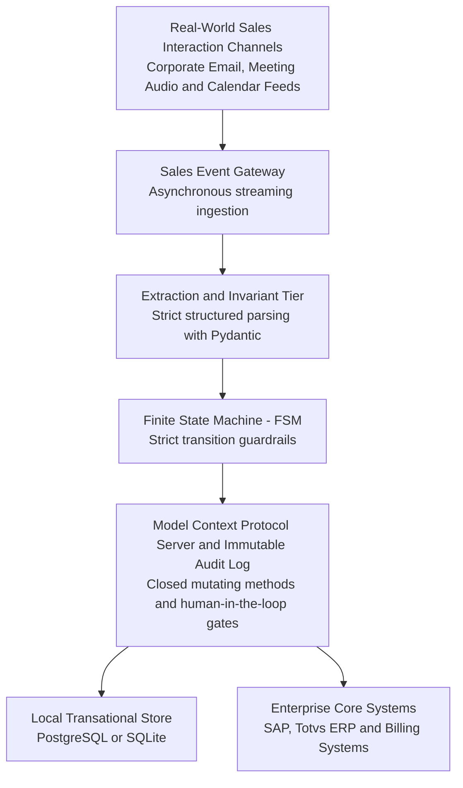

*Reading time: 16 minutes. Author: Hugo S. Nascimento.*

<!-- more -->

*Context: Written after auditing enterprise sales operations where organizations spend hundreds of thousands of dollars on recurring software seats only to have expensive account executives spend their working days typing data into forms. This guide establishes technical and balance-sheet criteria to decide between commercial suites, open source platforms, and zero-UI agentic architectures.*

> **Executive Summary for Technology Leaders:** Choosing between legacy commercial suites such as Salesforce, self-hosting open source options like Twenty CRM, or building a proprietary agentic stack depends directly on the cost of the Dual Bleed. For commercial operations with fewer than 15 account executives running standardized workflows, commercial SaaS presents minimal friction. Once the sales team exceeds 15 executives and the combined annual cost of software licenses and manual screen data entry exceeds 50,000 USD, building a zero-UI agentic stack operating over Model Context Protocol cuts operational expenses by up to 80 percent and permanently eliminates manual data entry.

---

## Public Diligence and Primary Sources

All pricing and licensing figures cited in this document were verified from public pricing pages and official documentation on September 28, 2026:

* **Salesforce Sales Cloud public pricing:** verified via <a href="https://www.salesforce.com/sales/pricing/">Salesforce Sales Pricing</a>.
* **HubSpot Sales Hub public pricing:** verified via <a href="https://www.hubspot.com/pricing/sales">HubSpot Sales Pricing</a>.
* **Twenty CRM source repository and documentation:** verified via <a href="https://twenty.com">Twenty Open Source CRM</a> and <a href="https://github.com/twentyhq/twenty">twentyhq/twenty on GitHub</a>.
* **Protocol specification:** verified via Anthropic documentation on <a href="https://modelcontextprotocol.io">Model Context Protocol Documentation</a>.

Legal compliance notice: referenced figures represent standard public list prices for individual annual commitments disclosed by vendors on the reference date. They do not account for private volume discounts negotiated by corporate procurement departments, custom reseller margins, or subsequent price changes enacted by trademark owners.

---

## 1. Enterprise B2B CRM Anatomy and the Dual Bleed

In complex enterprise B2B sales, a conventional CRM platform is not a growth accelerator. In practice, it is a relational database wrapped in dozens of web forms, visual validations, and rigid navigational tabs.

### The Real Account Executive Workflow
Consider the actual routine of a senior enterprise account executive after completing a discovery meeting with client stakeholders:

1. Concluding the executive conversation on video conferencing software.
2. Opening a browser and logging into a heavy enterprise CRM interface.
3. Manually searching for the existing company record to inspect master attributes.
4. Manually creating new contact records for participants, keying in names, titles, departments, email addresses, and direct phone numbers.
5. Creating a new deal record or updating an existing opportunity.
6. **Manually adjusting mandatory pipeline fields:** stage, win probability, target closing date, and weighted contract value.
7. Typing freeform meeting notes summarizing technical pain points and promised action items.
8. Switching browser tabs to electronic signature platforms to check contract drafts.
9. Returning to the CRM interface to update internal analytics fields mandated by Revenue Operations.

### The Visual Interface Paradox
This dependence on human graphical interfaces creates severe operational pathology:

* **Operational Resistance:** companies hire enterprise sellers for negotiation acumen, strategic domain grasp, and relationship building. Forcing them to spend hours filling form fields in web portals generates friction, dissatisfaction, and active evasion.
* **Degraded Data Fidelity:** treating CRM input as administrative chore causes sales reps to enter data hurriedly, incompletely, or days late. Many enter fictitious information solely to satisfy activity tracking dashboards.
* **Illusory Pipeline Visibility:** executive leadership and board members assume they have granular operational telemetry. In reality, they see delayed, subjective self-assessments influenced by quarterly quota anxiety.
* **Administrative Overhead:** organizations hire dedicated Revenue Operations analysts whose primary role degrades into auditing missing fields, badgering reps for updates, and deduplicating corrupted contact lists.

### The Economics of the Dual Bleed
The Dual Bleed occurs when an enterprise pays twice for the exact same business workflow:

* **Bleed 1:** Direct recurring software license fees per seat, compounded by mandatory annual commitments, storage overages, and per-resolution AI add-on fees.
* **Bleed 2:** Salaries, payroll taxes, and overhead paid to high-cost sales professionals who spend between 30 percent and 45 percent of productive hours acting as manual data-entry clerks.

Consider a standard enterprise sales organization with 20 account executives and 2 operational analysts:

* **Direct annual spend on enterprise SaaS tiers:** 80,000 USD to 95,000 USD annually.
* **Combined sales compensation:** roughly 2.4 million USD annually in base salaries and benefits.
* **Productivity waste from manual data entry:** 35 percent of productive hours lost translates to over 800,000 USD in misallocated payroll annually.
* **Combined impact:** the company burns nearly 900,000 USD every year to keep an imperfect, delayed visual system barely populated with subjective data.

---

## 2. The Buy Option: Proprietary Enterprise Suites

Procuring established market suites remains the default path for corporate leadership seeking to minimize vendor selection risk.

### Salesforce Sales Cloud Enterprise and Unlimited
Salesforce is the dominant global enterprise incumbent:

* **Pricing Model:** annual commitment required, billed on a per-seat monthly basis.
* **Enterprise Edition:** public list price of 175 USD per user monthly, totaling 2,100 USD annually per seat.
* **Unlimited Edition:** public list price of 350 USD per user monthly, totaling 4,200 USD annually per seat.
* **Agentforce 1 Sales Edition:** public list price of 550 USD per user monthly, bundling proprietary agent tools and data cloud consumption credits.
* **Professional Services Cost:** certified systems integrators charge initial scoping and deployment fees between 50,000 USD and 200,000 USD to configure custom objects, Apex automations, and Flow Builder logic.
* **Technical Strengths:** proven enterprise identity management, highly granular role-based access control, immense AppExchange partner ecosystem, and rigorous enterprise security certifications.
* **Structural Liabilities:** multi-year contracts with aggressive renewal terms, slow cycles for altering custom business logic, permanent reliance on certified administrators, and substantial extra fees for expanded data consumption or agentic features.

### HubSpot Sales Hub Enterprise
HubSpot targets mid-market and scaling enterprise teams prioritizing speed:

* **Pricing Model:** annual contract structured around seat minimums.
* **Enterprise Edition:** base price starting at 150 USD per sales seat monthly, with mandatory entry bundles of 10 seats at 1,500 USD monthly.
* **Mandatory Onboarding Fee:** one-time professional services charge between 3,500 USD and 6,000 USD upon initial setup.
* **Technical Strengths:** streamlined user experience accelerating rep onboarding, quick workflow configuration, and native integration with inbound marketing systems.
* **Structural Liabilities:** architectural constraints when modeling complex multi-tiered corporate hierarchies, exponential price escalation as contact databases scale, and brittle bidirectional synchronization against legacy ERP cores like SAP and Totvs.

### When Commercial SaaS Is the Rational Choice
The Buy route remains correct under specific operational parameters:

* The sales team consists of fewer than 15 account executives.
* Commercial workflows follow standard industry conventions without complex billing formulas or non-standard corporate approval matrices.
* The company possesses no internal software engineering capacity and relies entirely on external vendors.
* The sales mechanics do not represent the primary competitive moat of the enterprise.

---

## 3. The Adapt Option: Open Source with Twenty CRM

Adapting open source platforms allows enterprises to reclaim data sovereignty and eliminate recurring seat fees.

### Twenty CRM: Architecture and Capabilities
Twenty represents the leading modern open source CRM framework:

* **Central Repository:** open source codebase available at <a href="https://github.com/twentyhq/twenty">twentyhq/twenty</a> with extensive developer community adoption.
* **Technology Stack:** built on Node.js with TypeScript, NestJS backend framework, React frontend, GraphQL API layer, and PostgreSQL persistence.
* **Business Model:** completely free open source codebase for self-hosted infrastructure, alongside managed cloud tiers priced at 9 USD per seat monthly for Pro and 19 USD for Organization.
* **Extensibility:** dynamic custom object creation without manual SQL migrations, paired with a modular developer framework termed Twenty Apps.
* **Agent Integration:** native Model Context Protocol support in cloud workspaces, enabling external coding agents and assistants to inspect and mutate CRM state.

### Infrastructure Realities of Open Source
Running open source software in enterprise production requires engineering capital:

* **Cloud Hosting Costs:** maintaining containerized environments across AWS, Google Cloud, or dedicated instances with managed high-availability PostgreSQL, automated snapshots, and load balancers costs between 800 USD and 2,000 USD monthly.
* **Internal Maintenance Overhead:** applying security patches, running database migrations, and guaranteeing uptime requires 20 percent to 40 percent of a dedicated fullstack or DevOps engineer.
* **The Persistent Interface Dilemma:** while Twenty eliminates recurring per-seat software fees, it preserves a full graphical interface centered on human clicks. If account executives still spend hours typing into web forms, the human labor bleed remains unaddressed.

---

## 4. The Build Option: Zero-UI Agentic Stacks

Building an internal agentic sales system does not mean recreating Salesforce screens in React. It means deploying headless infrastructure where software agents operate core sales records over structured protocols.

### Publicly Documented Reference Implementations

The open source ecosystem in 2026 produced distinct frameworks designed specifically for agent operation:

#### 1. Clayton Agent CRM

* **Documentation and Repository:** available at <a href="https://github.com/clayton/agent-crm">clayton/agent-crm on GitHub</a>.
* **Core Architectural Thesis:** open source CRM built exclusively for autonomous agents, paired with a read-only human dashboard for pipeline inspection.
* **Zero Visual Mutations:** the dashboard contains zero forms, drag-and-drop controls, or mutation endpoints. Agents execute all pipeline state changes through a JSON command-line interface or typed Model Context Protocol tools.
* **Local Storage and Skeptical Review:** operates over local SQLite as the source of truth and incorporates an adversarial CRO review engine that flags unsupported revenue assumptions and expired pipeline commitments.

#### 2. Accordo Framework

* **Documentation and Repository:** available at <a href="https://github.com/khaoss85/agent-crm">khaoss85/agent-crm</a> and official portal <a href="https://accordo.dev">Accordo Dev</a>.
* **Core Architectural Thesis:** Node.js framework enabling coding agents to scaffold CRM applications as vendored, fully owned source code governed by deterministic workflows and audit logs.
* **Strict Execution Boundary:** agents never write directly to raw database tables. Every change routes through typed service methods enforcing business policies, author identity, and immutable run traces.
* **Protocol Surface:** stdio-based Model Context Protocol server exposing project inspection, deal listing, controlled stage transitions, and human approval gates.

#### 3. Comp AI and TryCRM Convex

* **Documentation and Repository:** reactive deployment available at <a href="https://github.com/waynesutton/trycrm-convex">waynesutton/trycrm-convex on GitHub</a>.
* **Core Architectural Thesis:** agentic-first CRM operating over reactive cloud data infrastructure.
* **Evidence Ledger:** autonomous research agents enrich accounts and contacts by logging verifiable source links, strictly rejecting ungrounded assumptions.

### Reference Architecture: Headless Agentic CRM



### Protocol Tool Contract in JSON Schema
Below is the strict JSON Schema definition utilized by autonomous agents to progress deal stages without human form intervention:

```json
{
  "name": "advance_deal_stage",
  "description": "Progresses enterprise deal stage upon verification of required documentary evidence",
  "parameters": {
    "type": "object",
    "properties": {
      "account_id": {
        "type": "string",
        "description": "Unique corporate account identifier within internal systems"
      },
      "tax_registration_id": {
        "type": "string",
        "description": "Verified corporate tax identifier validated against government registry"
      },
      "target_stage": {
        "type": "string",
        "enum": [
          "discovery_completed",
          "proposal_approved",
          "legal_review",
          "contract_signed"
        ]
      },
      "annual_contract_value": {
        "type": "number",
        "description": "Contract value calculated against active pricing book and verified terms"
      },
      "evidence_document_hash": {
        "type": "string",
        "description": "Cryptographic SHA256 hash of signed agreement or verified meeting minutes"
      }
    },
    "required": [
      "account_id",
      "tax_registration_id",
      "target_stage",
      "annual_contract_value",
      "evidence_document_hash"
    ]
  }
}
```

---

## 5. Comparative 24-Month TCO Matrix

Financial and operational estimates modeled for an enterprise sales department with 20 account executives and 2 operational analysts over 24 months:

| Evaluation Dimension | Buy: Salesforce Unlimited | Adapt: Twenty CRM Self-Hosted | Build: Headless MCP Agentic Stack |
| :--- | :--- | :--- | :--- |
| Primary Reference Sources | Official vendor pricing schedules | Public repository and docs | Clayton, Accordo, and MCP standards |
| 24-Month License Expenditure | 184,800 USD | Zero USD in open source tier | Zero USD in proprietary software fees |
| Cloud Infrastructure Cost | Included in seat subscription | 800 USD to 2,000 USD monthly | 400 USD to 1,200 USD monthly |
| Initial Implementation Cost | 60,000 USD to 180,000 USD | 20,000 USD to 45,000 USD | 35,000 USD to 75,000 USD |
| Rep Time Lost to Form Entry | 30 percent to 45 percent of hours | 30 percent to 45 percent of hours | Under 5 percent of productive hours |
| Pipeline Data Fidelity | Low, subject to rep quota bias | Low, reliant on manual updates | High, grounded in event telemetry |
| Vendor Lock-in Risk | Severe, complex data extraction | Low, schema fully owned | Zero, codebase and database internal |
| Ongoing Specialist Dependency | Dedicated certified administrator | Part-time fullstack engineer | Systems software engineer |

---

## 6. Frequently Asked Questions

### Is it economically viable to build a proprietary CRM instead of purchasing SaaS?
Building an internal stack is viable when the sales organization exceeds 15 account executives and operates custom workflows where recurring seat licenses combined with manual rep data entry waste more than 50,000 USD annually. For small commercial teams with conventional workflows, adopting entry-tier commercial SaaS remains the most cost-effective path.

### What defines a zero-UI agentic CRM?
It is a system of record where sales executives never interact with visual data-entry screens. The platform listens to ambient commercial events such as meetings, corporate emails, and contract exchanges, validates structured entities against strict code invariants, and mutates records over protocols like Model Context Protocol, maintaining human dashboards strictly for read-only inspection and approval.

### What are the primary technical risks of self-hosting Twenty CRM?
The primary technical risk is allocating internal engineering bandwidth to handle periodic security updates, database replication on PostgreSQL, and infrastructure availability. Furthermore, unless custom autonomous ingestion workflows are engineered around it, sales reps still face the same manual screen entry burden present in proprietary platforms.

---

## 7. Decision Diagnostic Checklist

Assign the indicated points for each affirmative response regarding your enterprise sales setup:

* **Criterion 1:** Does the commercial organization employ 15 or more dedicated enterprise account executives?
  * **Score:** 2 points.

* **Criterion 2:** Does total annual spend on CRM software licenses exceed 50,000 USD?
  * **Score:** 3 points.

* **Criterion 3:** Do account executives report losing more than one hour daily updating CRM forms and pipeline stages?
  * **Score:** 3 points.

* **Criterion 4:** Do revenue forecasts regularly miss targets due to outdated or fabricated pipeline records?
  * **Score:** 2 points.

* **Criterion 5:** Does your sales model require complex pricing logic and approvals that demand expensive custom code in commercial tools?
  * **Score:** 3 points.

* **Criterion 6:** Do internal compliance policies mandate that customer transcripts and contracts remain strictly within private cloud perimeters?
  * **Score:** 2 points.

* **Criterion 7:** Must the CRM integrate continuously with legacy ERP cores such as SAP, Totvs Protheus, or mainframes?
  * **Score:** 3 points.

* **Criterion 8:** Does your company maintain an internal engineering team or trusted partner capable of managing containerized services?
  * **Score:** 2 points.

* **Criterion 9:** Does executive leadership seek structural OPEX reduction rather than deploying generic chat copilots on top of SaaS seats?
  * **Score:** 3 points.

* **Criterion 10:** Does your commercial execution model represent the primary competitive advantage of your enterprise?
  * **Score:** 3 points.

### Score Interpretation

* **0 to 8 points:** Choose Buy. The scale does not justify proprietary engineering. Subscribe to standard commercial tiers and focus organizational energy on commercial execution.
* **9 to 16 points:** Choose Adapt with Twenty CRM. Software license spend is beginning to stress operational margins. Self-hosting Twenty CRM eliminates per-seat fees and secures data ownership.
* **17 to 26 points:** Build with HSN Labs. Your organization bears the full weight of the Dual Bleed. Spending hundreds of thousands on manual screens drains capital and wastes valuable selling capacity.

---

## 8. Progressive Replacement Strategy

Decommissioning legacy enterprise CRM platforms should never be executed via sudden cutover. At HSN Labs, we execute the Progressive Replacement methodology across four controlled phases:

* **Phase 1:** Passive Listening. Agents connect to communication gateways, mapping accounts and stakeholder graphs in the background without disturbing active sales reps.
* **Phase 2:** Active Assistance. Agents generate meeting preparation briefs and draft follow-up correspondence, winning rep trust by saving tangible selling time.
* **Phase 3:** Interface Bypass. Agents assume responsibility for updating deal records directly in the central database, rendering manual login to the legacy CRM optional.
* **Phase 4:** Financial Decommissioning. Formal cancellation of surplus SaaS user seats, realizing audited cost reductions on the corporate balance sheet.

---

## Audited Industry Benchmark

Klarna: deprecated Salesforce CRM and Zendesk enterprise contracts in favor of an internal agentic stack built on Neo4j graph databases, generating 40 million USD in audited annual operational savings and absorbing the workload of 700 full-time outsourced operators.

---

## Strategic Resources and Related Essays
- <a href="../bpo-replacement-matrix/">The BPO Replacement Matrix: Operational and Financial Metrics</a>
- <a href="../palantir-pricing-tco-and-open-alternatives/">The Real TCO of Palantir: The Dollar Barrier and Modern Open Alternatives</a>
- <a href="../c-suite-margin-protection-playbook/">The C-Suite Transition Playbook: Protecting Margins in the Agentic Economy</a>
- <a href="https://hsnlabs.ai/bootcamp">Apply for the HSN Labs Five-Day Architecture Bootcamp</a>