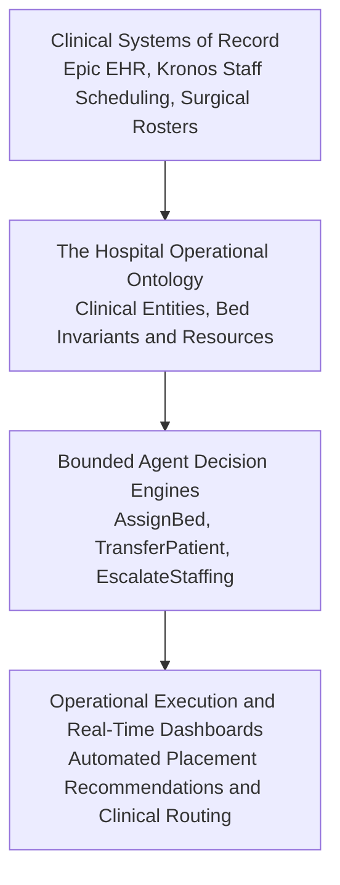

*Reading time: 5 minutes. Author: Hugo S. Nascimento.*

Healthcare operations present the ultimate stress test for enterprise software.

When an autonomous system fails in marketing or social media, a brand posts an embarrassing sentence. When an operational system fails in a hospital network, emergency departments divert ambulances, surgical suites stand empty, and patients wait hours for acute care beds.

Cleveland Clinic is one of the premier academic medical centers in the world. Their network encompasses 23 hospitals, 275 outpatient locations, over 6,600 acute beds, and 19,000 nurses.[6]

Managing patient flow across a healthcare infrastructure of this magnitude is a logistical nightmare. 

Here is an architectural field audit of how Cleveland Clinic moved from spreadsheet friction to an operational ontology, and the quantifiable metrics that resulted from their deployment.[6]

---

## 1. The Pre-Agent Bottleneck: Spreadsheet Chaos

Before implementing an operational data architecture, patient bed placement and nurse staffing relied on manual human coordination.[6]

Every morning across 23 hospitals:

- Nursing managers spent several hours each shift manually reviewing static spreadsheets.[6]
- Clinical supervisors placed hundreds of phone calls between intensive care units, post-anesthesia wards, and emergency departments to identify departing patients.[6]
- **Discharge projections were fundamentally backward-looking:** staff reacted to bed vacancies hours after patients physically vacated rooms.

This friction created massive operational delays. 

Patients requiring acute specialized transfers were delayed at regional community hospitals because central coordination could not calculate campus-wide capacity in real time.[6]

---

## 2. Why Generic AI and Pure RAG Fail in Hospital Operations

Many healthcare systems attempt to solve this operational friction by layering generic LLMs or basic conversational assistants on top of electronic health record databases.

These pilots consistently fail in production:

1. **High Invariant Strictness:** A patient cannot be placed into an empty bed if that bed lacks hemodynamic monitoring or if the assigned nurse has already exceeded clinical patient-to-nurse acuity ratios.
2. **Temporal Degradation:** Patient vital signs and discharge statuses change minute by minute. A vector database index updated on an hourly batch cadence provides dangerously stale context.
3. **The Hallucination Danger:** In healthcare logistics, an unverified guess regarding bed availability triggers regulatory violations and immediate clinical risk.

Cleveland Clinic did not deploy a chatbot to converse with doctors. They deployed an **Operational Ontology** that binds clinical data directly to automated decisions.[5][6]

---

## 3. The Architecture: Digital Twin of Hospital Operations

The platform constructs an active operational representation of the entire hospital network:[6]

Instead of asking a generative model to compose free-text clinical instructions, automated reasoning engines execute against strict ontology objects:[5]

- **Granular Demand Forecasting:** Projecting exact patient census and acuity levels for every hospital unit hours before admissions peak.[6]
- **Algorithmic Staff Matching:** Dynamically aligning nurse supply with forecasted clinical demand across acute institutes.[6]
- **Automated Placement Routing:** Identifying incoming surgical patients and reserving optimal post-operative recovery beds with zero human phone tag.[6]

---

## 4. Audited Production Impact

The implementation produced immediate, audited improvements across Cleveland Clinic operations:[6]

- **75% reduction in time spent calculating bed capacity:** Clinical teams transitioned from manual multi-hour spreadsheet reconciliations to instant, real-time capacity visibility.[6]
- **>10% increase in daily hospital transfers:** Accelerating placement workflows allowed the health system to accept more critical patient transfers from regional facilities without expanding physical footprint.[6]
- **Proactive Shift Balancing:** Nursing leadership shifted from reactive crisis management on the morning of a shift to proactive staffing schedules established days and weeks in advance.[3][6]

---

## 5. The Enterprise Takeaway: The Ontology is the Asset

The operational success of Cleveland Clinic contains a universal lesson for enterprise technology leaders:

The commercial value of artificial intelligence is not unlocked by the foundation model. The foundation model is a commodity reasoning engine. 

The real enterprise asset is the **Operational Ontology**—the strongly-typed software model of your company's physical assets, legal constraints, and transactional execution perimeters.[5]

Whether you manage 6,600 hospital beds, international freight lines, or financial loan books, the formula for production reliability remains unchanged:

- Stop building free-text conversational chatbots.
- Map your operational business ontology in code.
- Bind autonomous actions to deterministic validation perimeters.

---

## Sources

[3] https://www.palantir.com/impact/tampa-general-hospital — Tampa General Hospital Case Study: Infusing Data Throughout the Care Continuum
[5] https://www.palantir.com/platforms/foundry/ontology — Palantir Foundry: Operational Ontology Overview
[6] https://www.palantir.com/impact/cleveland-clinic — Cleveland Clinic Impact Study: Enhancing Hospital Operations with Palantir Foundry

## Strategic Resources and Related Essays
- <a href="../how-to-build-an-enterprise-ontology-from-scratch/">How to Build an Enterprise Ontology from Scratch: Step by Step</a>
- <a href="../unconstrained-agents-finite-state-machines/">Case Study: 42 Calls in a Loop at 2 AM</a>
- <a href="../the-operational-ontology/">The Operational Ontology: How Enterprises Connect LLMs to Proprietary State</a>
- <a href="https://hsnlabs.ai/bootcamp">Apply for the HSN Labs Five-Day Architecture Bootcamp</a>