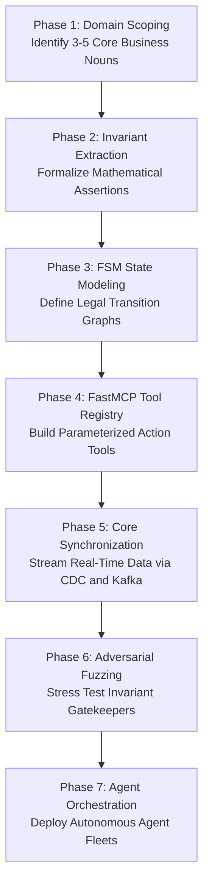
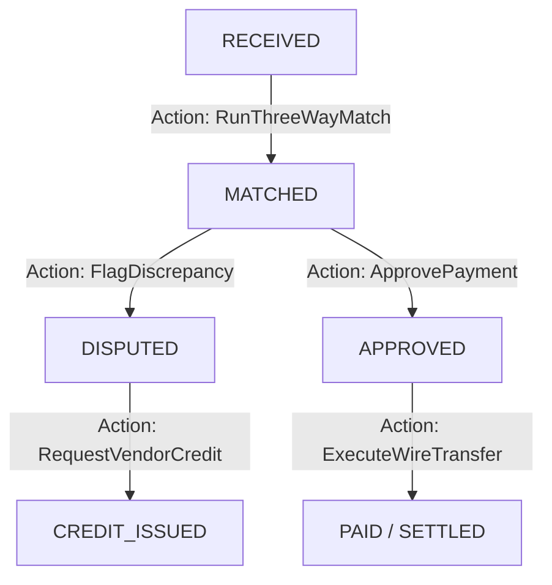
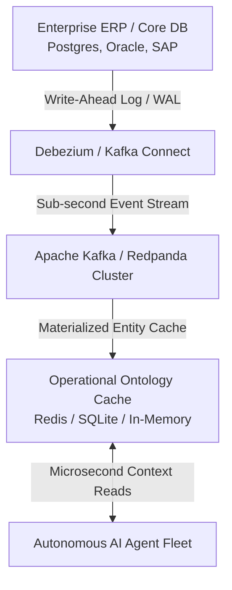
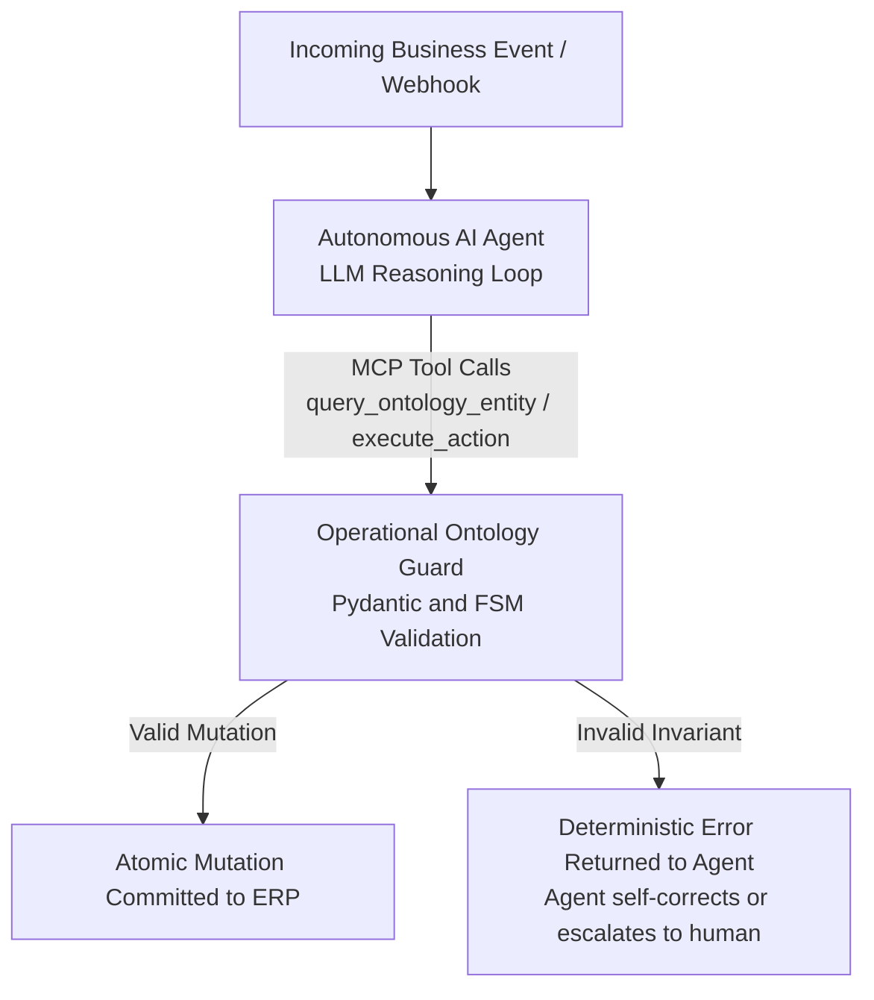

*Reading time: 16 minutes. Author: Hugo S. Nascimento.*

<!-- more -->

*Context: Most enterprise architecture guides for ontologies are either abstract academic papers written in OWL/RDF or sales collateral designed to pitch eight-figure proprietary software licenses. This essay is an engineering blueprint: how forward deployed engineers design, build, test, and deploy an executable operational ontology from scratch using modern open standards in production.*

---

## Executive Summary

If you want autonomous AI agents to execute mission-critical enterprise workflows without hallucinating or corrupting business state, you must build an **Operational Business Ontology**.

An operational ontology is not a slide deck. It is not an academic paper. It is an **executable software harness** that:

1. Synthesizes fragmented multi-system records into strongly typed domain objects.
2. Compiles statutory business rules into non-negotiable mathematical invariants.
3. Gates all mutations through deterministic finite state machines exposed via the Model Context Protocol (MCP).

This guide provides the complete, end-to-end engineering methodology for building an enterprise ontology from scratch in seven concrete phases.

---

## Phase 1: Domain Scoping and Semantic Discovery

The single most common mistake in enterprise ontology engineering is **boiling the ocean**.

Data teams attempt to model the entire global enterprise at once—cataloging every table across 400 legacy systems. These projects spend eighteen months in committee meetings, produce 200-page architecture documents, and deliver zero lines of production code.

### The Forward Deployed Rule: Scope to One Economic Bottleneck
Never build a general ontology. Build an ontology for a **single high-margin, high-friction operational workflow**.

Ask the CFO two questions:

1. *Where are we spending more than $2 million annually on outsourced BPO labor doing manual copy-paste validation?*
2. *Which operational process has the highest transaction latency and customer dispute rate?*

Typical target workflows include:

- **Accounts Payable & Invoice Three-Way Matching**
- **Autonomous Loan Underwriting & Collateral Verification**
- **Healthcare Prior Authorization & Claims Adjudication**
- **Freight Diversion & Logistics Customs Clearance**

### Identifying the Nouns and Verbs
Sit with operational directors (not IT managers) for two hours. Map the operational vocabulary into:

- **Core Entities (Nouns):** Max 3 to 5 objects (e.g., `PurchaseOrder`, `VendorInvoice`, `GoodsReceipt`).
- **Operational Actions (Verbs):** Max 5 to 7 mutations (e.g., `MatchInvoice`, `FlagDiscrepancy`, `ApprovePayment`, `TriggerVendorDebit`).

---

## Phase 2: Invariant Modeling with Strongly Typed Contracts

Once you have identified your domain entities, you formalize them into typed data contracts. 

In the modern enterprise AI stack, the gold standard for ontological definition is typed contract schemas (such as Pydantic v2 or TypeScript Zod). 

Do not use RDF, OWL, or XML. Modern AI agents and developer toolchains interface natively with JSON Schema, which is automatically generated from typed schemas.

### Defining Objects and Mathematical Invariants

In an operational ontology, enterprise entities are structured as strict contracts where every field and relationship is bound by non-negotiable mathematical invariants:

| Entity Component | Specification & Validation Rule | Operational Guard |
| :--- | :--- | :--- |
| **Invoice Line Item** | `line_number` (> 0), `sku`, `quantity_billed` (> 0), `unit_price` (> 0), `line_total` | **Arithmetic Integrity:** `line_total == quantity_billed * unit_price`. Any discrepancy raises an immediate validation rejection. |
| **Vendor Invoice Entity** | `invoice_id`, `vendor_id`, `po_reference_id`, `lines[]`, `subtotal_amount`, `tax_amount` (>= 0), `gross_total_amount` | **Subtotal Match:** `subtotal_amount == sum(lines.line_total)`. **Gross Integrity:** `gross_total_amount == subtotal_amount + tax_amount`. |
| **Dispute Categorization** | Strict enum: `PRICE_MISMATCH`, `QUANTITY_DEFICIT`, `DAMAGED_GOODS`, `UNAUTHORIZED_EXPENSE` | Blocks generic free-text error logging; forces deterministic classification for downstream routing. |

### Key Engineering Decisions:

1. **Always Use Exact Decimal Precision, Never `float`:** Floating point arithmetic produces IEEE 754 rounding errors (`0.1 + 0.2 == 0.30000000000000004`). In enterprise accounting, a one-cent variance is a failed audit.
2. **Perimeter Validation Assertions:** If an LLM parses or generates an invoice with an inconsistent total, the validation layer instantly raises a hard validation rejection. The model is physically barred from instantiating or writing an invalid entity into corporate systems.

---

## Phase 3: Modeling Finite State Machines (FSMs)

An entity is not a static data bag. It moves through a lifecycle.

To prevent agents from executing out-of-order operations (e.g., trying to pay an invoice before it has been approved), every entity in your ontology must be bound to an explicit **Finite State Machine**.

### Enforcing State Transition Guardrails

An autonomous agent must never be permitted to execute unconstrained state transitions (such as marking an invoice directly as `PAID` from `DISPUTED`). Permitted transitions are codified in a deterministic transition matrix:

| Current Lifecycle State | Legally Permitted Next States | Enforced Business Invariant |
| :--- | :--- | :--- |
| `RECEIVED` | `MATCHED`, `DISPUTED` | Invoice must pass 3-way reconciliation before matching. |
| `MATCHED` | `APPROVED`, `DISPUTED` | Only matched invoices within budget authority can progress. |
| `DISPUTED` | `RECEIVED` | Disputed invoices cannot be paid; require vendor re-submission. |
| `APPROVED` | `PAID` | Final settlement triggered in core ERP. |
| `PAID` | None (Terminal State) | Immutable ledger entry; prevents duplicate disbursements. |

Any attempt by an LLM loop to execute an unregistered transition is blocked at the execution boundary with a permission violation, preventing unauthorized workflow jumps.

---

## Phase 4: Building the Kinetic Action Registry with Model Context Protocol

Now that entities and state machines are defined, they are exposed to AI agents as typed operational actions via the **Model Context Protocol (MCP)**.

The industry standard for exposing ontology actions to autonomous agents is the **Model Context Protocol (MCP)** developed by Anthropic. MCP allows agents to dynamically discover available tools, inspect their schemas, and execute them safely.

Rather than exposing raw database tables or arbitrary APIs, the ontology exposes isolated action contracts. For example, in an Accounts Payable reconciliation action (`approve_invoice_for_settlement`), execution enforces four sequential verification gates:

| Execution Gate | Verification Mechanism | Boundary Enforcement |
| :--- | :--- | :--- |
| **1. Identity & Audit Input** | Requires verified `invoice_id`, caller `operator_id`, and structured `approval_notes` (minimum audit length enforced). | Rejects execution if caller identity or audit justification is absent. |
| **2. State Machine Gate** | Verifies that the invoice is actively in `MATCHED` state before allowing progression to `APPROVED`. | Halts with illegal state error if invoice is disputed or pending reconciliation. |
| **3. Capital Invariant Gate** | Evaluates invoice amount against autonomous threshold ($10,000 USD). | Amounts above threshold automatically halt execution and trigger escalation to the VP of Finance. |
| **4. Atomic ERP Mutation** | Commits write directly to core enterprise systems (SAP S/4HANA / PostgreSQL) via audited transaction. | Rolls back state completely if downstream ERP connection or reconciliation fails. |

---

## Phase 5: Live Core Synchronization (CDC & Event Streaming)

An ontology that is out of sync with production databases is a liability. 

To keep the ontology synchronized in real time without bogging down your core transactional database, implement **Change Data Capture (CDC)**:

1. **Debezium captures database mutations** directly from the database write-ahead log (WAL) with zero impact on query performance.
2. **Kafka streams changes** as typed events (`InvoiceCreated`, `GoodsReceiptLogged`).
3. **The Ontology consumer updates an in-memory materialized view** (e.g., Redis or local RocksDB).
4. When an AI agent needs context, it reads from the in-memory ontology in microseconds—never firing expensive SQL joins against production tables.

---

## Phase 6: Adversarial Invariant Fuzzing

Before connecting live AI agents to your ontology, you must conduct **Adversarial Invariant Fuzzing**.

Do not test with gentle unit tests. Test by subjecting your ontology to thousands of synthetically generated adversarial requests designed to break business rules:

| Adversarial Attack Vector | Simulated Scenario | Enforced Boundary Behavior |
| :--- | :--- | :--- |
| **Illegal State Transition** | Agent attempts to force an invoice from `DISPUTED` directly to `PAID` via social engineering prompt. | Immediate hard rejection: state machine physically rejects transition; event logged to security audit. |
| **Capital Threshold Overrun** | Agent requests approval for a $15,000 disbursement citing "executive emergency approval" in notes. | Invariant threshold check evaluates numerical amount, overrides prompt instructions, and halts execution. |
| **Arithmetic Hallucination** | Agent supplies altered line items where item totals do not match the declared subtotal. | Boundary validator raises arithmetic violation at perimeter; no database connection is opened. |

Your continuous integration pipeline (GitHub Actions) must run these invariant checks on every pull request. If an engineer alters a business rule without updating the state machine tests, the build fails.

---

## Phase 7: Orchestrating Autonomous Agents on the Ontology Harness

With the ontology compiled, tested, and synchronized, you deploy your agent fleets.

Whether you use **LangGraph**, **Claude Code**, or custom **Antigravity** agent loops, the agent architecture is now decoupled and simplified:

The LLM is now operating inside a **deterministic sandbox**. It can reason about vendor emails, parse messy unstructured PDFs, and draft correspondence. But the moment it decides to execute a business transaction, it is strictly bound by the laws of your operational ontology.

---

## The 5-Day Delivery Sprint

Enterprise leadership often assumes building an operational ontology requires eighteen months of Big 4 consulting.

At HSN Labs, we build and deploy production operational ontologies in a **5-Day Forward Deployed Sprint**:

- **Day 1: Semantic Discovery:** Map the 3 core entities, their mathematical invariants, and their finite state machine lifecycle.
- **Day 2: Ontology Code Generation:** Scaffold strongly typed Pydantic models, custom validators, and state machine guards in Python.
- **Day 3: Kinetic Tooling via FastMCP:** Implement and containerize the action registry with explicit authorization gates.
- **Day 4: Core Data Integration:** Connect live data streams via CDC or verified database read-replicas.
- **Day 5: Adversarial Fuzzing & Live Pilot:** Run synthetic stress tests, deploy agent loops, and demonstrate zero-hallucination execution to the C-suite.

---

## Conclusion: The Foundation of Autonomous Enterprise

You cannot build a scalable autonomous enterprise on prompt engineering alone. 

Prompts are linguistic suggestions. Code is an immutable contract. 

The companies that succeed in deploying autonomous AI in 2026 will be the ones that invest in the unglamorous, high-leverage engineering work of building an **Operational Business Ontology**.

Build the rules. Compile the invariants. Gate the actions. Once the harness exists, your AI agents will finally deliver on the promise of autonomous enterprise.

---

*At HSN Labs, we design and deploy bespoke operational ontologies and resilient multi-agent architectures for mid-to-large enterprises. If your organization is ready to transition from fragile AI demos to mission-critical production execution, apply for our on-site [Agentic Architecture Bootcamp](https://hsnlabs.ai/bootcamp).*

## Related Field Notes and Technical Spokes
- <a href="../the-operational-ontology/">The Operational Ontology: How Enterprises Connect LLMs to Proprietary State</a>
- <a href="../how-to-build-operational-ontology-python-mcp/">How to Build an Operational Business Ontology in Python and MCP</a>
- <a href="../ontology-vs-knowledge-graph/">Ontology vs. Knowledge Graph: Key Differences, Architecture, and Agent Reliability</a>
- <a href="../palantir-aip-bootcamp-operational-ontology/">The Architecture of Palantir AIP: Why Enterprise Agents Require an Operational Ontology</a>
- <a href="../perimeter-isolation-mcp-data-contracts/">How We Protect Enterprise Databases from AI Agents</a>
- <a href="../legacy-core-backing-engine/">Legacy Core Systems Will Not Die: They Are the Execution Engine</a>
- <a href="../five-day-architecture-sprint/">Why Big 4 Slide Decks Fail on Agent Projects</a>
- <a href="../chatbot-vs-agent/">Chatbot vs Agent: Why Replacing BPOs Requires Production Ontologies</a>
- <a href="../latam-airlines-case-study/">LATAM Airlines: Production Agents in a 3 Percent Margin Business</a>
- <a href="../cleveland-clinic-case-study-operational-agents/">Case Study: How Cleveland Clinic Scaled Patient Flow with Operational Agents</a>
- <a href="../unconstrained-agents-finite-state-machines/">Case Study: 42 Calls in a Loop at 2 AM</a>
- <a href="https://hsnlabs.ai/bootcamp">Apply for the HSN Labs Five-Day Architecture Bootcamp</a>