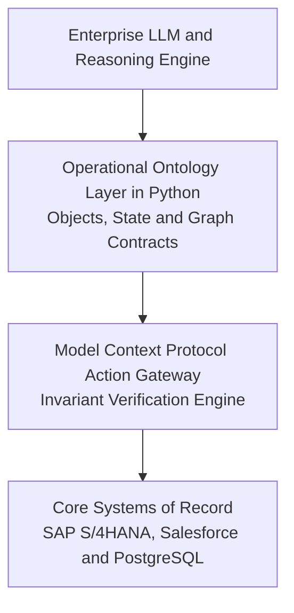

*Reading time: 6 minutes. Author: Hugo S. Nascimento.*

The defining difference between a toy AI demonstration and a mission-critical enterprise agent is the execution layer.

When an autonomous agent interacts with unstructured vector embeddings, it hallucinates. When it interacts with an **Operational Ontology**—strongly-typed business entities with strict transactional constraints—it executes reliably in production.[5]

Palantir built a multi-billion dollar enterprise software business around this exact insight.[1][5] 

However, engineering teams do not need a seven-figure proprietary contract to deploy this architecture. Using modern open-source standards—specifically **Pydantic v2**, the **Model Context Protocol (MCP)**, and typed state machines—you can build a resilient operational ontology directly in Python.[7][8]

Here is the exact architectural blueprint.

---

## 1. Deconstructing the Operational Ontology

In enterprise operations, data cannot be treated as passive tabular rows. An operational ontology consists of three interconnected software layers:[5]

1. **Objects:** Normalized representations of real-world business entities (e.g., Invoices, Purchase Orders, Hospital Beds, Freight Shipments).[5]
2. **Properties and Links:** Strongly-typed attributes and deterministic relationships connecting entities together (e.g., an `Invoice` links to a `PurchaseOrder` and an approved `VendorAccount`).[5]
3. **Actions:** Guarded mutations and write-backs that alter system state across external transactional APIs (e.g., `ApprovePayment`, `ReassignBed`, `ReleaseEscrow`).[5]

---

## 2. Layer 1: Defining Objects and Invariants with Typed Contracts

In an enterprise architecture, rather than passing unvalidated dictionaries or raw strings to an LLM, every business entity is defined as an immutable data contract.[8]

In an automated enterprise dispute resolution workflow, the entity contract enforces strict perimeter invariants:

| Contract Attribute | Type / Constraints | Enforced Invariant & Business Guard |
| :--- | :--- | :--- |
| `dispute_id` | Pattern `^DISP-[0-9]{8}$` | Standardized audit key; prevents collision or untracked claims. |
| `invoice_number` | String (min 5 chars) | Verified foreign key to active accounts payable ledger. |
| `vendor_id` | String (min 3 chars) | Must map to an active, KYC-cleared corporate supplier. |
| `claimed_amount` | Decimal (> 0) | Exact decimal precision; zero or negative values rejected. |
| `contract_tolerance_pct` | Decimal (0.00 to 0.10) | Bounded contractual tolerance (default 2%, capped at 10%). |
| `category` | Strict Enum | Restricted to `PRICING_DISCREPANCY`, `DAMAGED_GOODS`, `SHORT_SHIPMENT`. |
| `reconciliation_threshold` | Boundary Check | Claims exceeding $50,000 USD trigger mandatory executive escalation. |

By wrapping business objects in strict schemas, invalid model inputs are rejected at serialization before reaching execution code.[8]

---

## 3. Layer 2: Model Context Protocol (MCP) Action Gateways

Autonomous agents should never possess raw direct database write access. All state mutations must pass through an action gateway.

The Model Context Protocol (MCP) is an open specification that standardizes how applications provide context and tools to LLMs.[7] MCP operates like a universal port, allowing agents to execute functions across secure infrastructure without bespoke integrations.[7]

In an atomic dispute settlement workflow (`execute_dispute_settlement`), the MCP gateway enforces three sequential verification gates before committing any change to the enterprise ledger:

| Gateway Step | Execution Gate | Boundary Rule |
| :--- | :--- | :--- |
| **1. Entity Verification** | Fetches live entity from transactional graph. | If dispute record does not exist or is closed, execution aborts immediately. |
| **2. Financial Invariants** | Evaluates proposed settlement against claimed amount and capital limit. | **Rule A:** Settlement cannot exceed original claimed amount. **Rule B:** Settlements over $5,000 USD require Human-in-the-Loop dual authorization. |
| **3. Atomic ERP Commit** | Posts verified credit memo to SAP / core billing system. | Generates immutable transaction audit ID and returns cryptographically signed receipt. |

This pattern ensures that the language model functions exclusively as a planner. The actual state modification is guarded by deterministic code invariants.

---

## 4. Layer 3: State Machines and Invariant Auditing

Production agents cannot operate in open-ended ReAct loops that iterate indefinitely. They must be bounded by finite state machines.

By modeling the agent's workflow as a directed acyclic graph (using **LangGraph** or **Temporal**), every transition between states is auditable:

1. **State: Ingestion:** Ingest raw payload and parse into `InvoiceDispute` model.[8]
2. **State: Context Enrichment:** Hydrate object with ERP purchase order history and vendor scorecards.
3. **State: Evaluation:** Prompt the model to evaluate liability based strictly on contract terms.
4. **State: MCP Action Dispatch:** Submit candidate resolution to the MCP action gateway.[7]
5. **State: Final Reconciliation:** Log cryptographic transaction audit trail to PostgreSQL.

If the model encounters an anomalous edge case, the state machine halts and routes the payload to a human operator queue with zero risk of silent failure.

---

## 5. Architectural Comparison: Open Stack vs Proprietary Platform

| Architecture Layer | Open Python + MCP Stack | Palantir Foundry / AIP |
|---|---|---|
| **Data Contracts** | Pydantic v2 (Native Python / JSONSchema)[8] | Proprietary Ontology Object Builder[5] |
| **Tool Execution** | Model Context Protocol (Open Standard)[7] | AIP Actions & Foundry Functions[5] |
| **State Orchestration** | LangGraph / Temporal / Celery | Foundry Workshop & AIP Automate |
| **Storage & Graph** | PostgreSQL, pgvector, Neo4j | Palantir Monolith / Titan |
| **Licensing Cost** | $0 Base Software Licensing | Multi-Million USD Enterprise Contract[1] |
| **Infrastructure** | Runs inside client AWS/GCP VPC | Dedicated SaaS or Palantir Managed Tenant |

---

## 6. The Production Takeaway

Enterprise AI is not a prompt engineering problem; it is a distributed systems engineering problem.

By replacing opaque prompts with strongly-typed Pydantic contracts and routing agent execution through Model Context Protocol gateways, technology leaders gain the operational precision of Palantir without the seven-figure vendor lock-in.[1][5][7][8]

---

## Sources

[1] https://www.sec.gov/Archives/edgar/data/1321655/000132165524000022/pltr-20231231.htm — Palantir Technologies Inc. Form 10-K Annual Report
[5] https://www.palantir.com/platforms/foundry/ontology — Palantir Foundry: Operational Ontology Overview
[7] https://modelcontextprotocol.io/introduction — Model Context Protocol Specification and Architecture
[8] https://docs.pydantic.dev/latest — Pydantic: Fast Data Validation for Python

## Strategic Resources and Related Essays
- <a href="../how-to-build-an-enterprise-ontology-from-scratch/">How to Build an Enterprise Ontology from Scratch: Step by Step</a>
- <a href="../ontology-vs-knowledge-graph/">Ontology vs. Knowledge Graph: Key Differences, Architecture, and Agent Reliability</a>
- <a href="../palantir-aip-bootcamp-operational-ontology/">The Architecture of Palantir AIP: Why Enterprise Agents Require an Operational Ontology</a>
- <a href="https://hsnlabs.ai/bootcamp">Apply for the HSN Labs Five-Day Architecture Bootcamp</a>