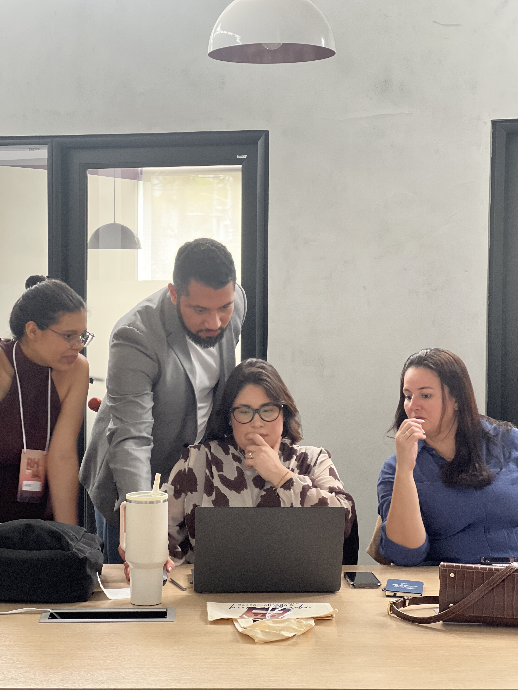

<figure style="max-width: 460px; margin: 0 auto 2.5rem auto; text-align: center;">
  
  <figcaption style="font-size: 0.88rem; color: #64748b; margin-top: 0.6rem; line-height: 1.4;">Capa da edicao brasileira de A Metamorfose de Franz Kafka, traduzida por Modesto Carone para a Companhia das Letras.</figcaption>
</figure>

*Reading time: 7 minutes. Author: Hugo S. Nascimento.*

<!-- more -->

*Para quem nunca leu o livro: fiquem tranquilos. Deixei logo abaixo uma sintese sem spoilers para entender o contexto. No final do texto, separei uma secao com o resumo completo com spoilers para quem quiser acompanhar todo o desfecho.*

---

No dia 26 de setembro de 2026, passei oito horas com vinte profissionais e liderancas de Recursos Humanos no Hub Plural Espinheiro, em Recife. Ao lado de Thays Neri, conduzi o <a href="https://www.sympla.com.br/evento/workshop-rh-depois-da-ia/3549049" target="_blank" rel="noopener">Workshop RH depois da IA</a>, um encontro desenhado para tirar a tecnologia das apresentacoes teoricas e coloca-la no centro da operacao de gestao de pessoas.

<figure style="max-width: 680px; margin: 2rem auto; text-align: center;">
  
  <figcaption style="font-size: 0.88rem; color: #64748b; margin-top: 0.6rem; line-height: 1.4;">Aplicacao pratica na tela: analisando em conjunto como construir instrucoes com contexto real e avaliar respostas de modelos para processos de selecao e politicas internas.</figcaption>
</figure>

Nao ficamos presos a palestras expositivas. O foco do encontro foi a execucao real. Cada participante abriu seu computador para desenhar comandos com criterios claros, estruturar bases de dados para agentes e testar na pratica onde a inteligencia artificial resolve gargalos de rotina, como analise de perfis de candidatos, comunicacao interna e desenho de processos.

Mas, em um dado momento da tarde, a conversa inevitavelmente ultrapassou o teclado. Quando olhamos para a velocidade com que agentes digitais realizam fluxos inteiros em questao de segundos, surgiu a pergunta central: o que acontece com a sociedade quando parte relevante das pessoas nao for mais demandada em regime tradicional de quarenta horas semanais?

Falamos sobre Renda Basica Universal, sobre economia pos-trabalho e sobre a identidade de quem trabalha. Naquele instante, lembrei de um livro lancado em 1915: *A Metamorfose*, de Franz Kafka. O silencio que se instalou na sala mostrou que aquela inquietacao nao era so minha. Sai de la com a urgencia de organizar essa reflexao por escrito.

---

### O homem que acorda animalizado

Para quem ainda nao teve contato com a obra de Kafka, a narrativa comeca de forma seca e direta. Gregor Samsa, um caixeiro-viajante que sustenta sozinho os pais e a irma, acorda em sua cama apos sonhos intranquilos e descobre que seu corpo virou um inseto monstruoso. Ele tem uma carcaca rigida nas costas, ventre marrom dividido em gomos e pernas delgadas que se agitam sem coordenacao.

O ponto mais forte da obra nao e a metamorfose fisica. E a reacao imediata do personagem.

Gregor acabou de perder sua forma humana, mas seu olhar vai direto para o despertador. Ele perdeu o trem das cinco. Esta atrasado para o trabalho. Comeca a se desesperar pensando no gerente aparecendo em sua casa, na bronca que vai levar e na divida comercial dos pais com o patrao.

Mesmo reduzido a um bicho que mal consegue rolar na cama, sua consciencia segue domesticada pelo compromisso de produzir. Ele nao lamenta a perda da condicao de homem. Ele teme a perda do emprego.

---

### Reflexao sobre o utilitarismo e o valor intrinseco do trabalhador

Para quem nunca estudou essas correntes, o utilitarismo e uma escola de pensamento surgida na Inglaterra no seculo dezoito com filosofos como Jeremy Bentham e John Stuart Mill. Em termos simples, o utilitarismo defende que uma escolha, regra ou acao e correta quando gera a maxima utilidade e o maximo bem-estar para o maior numero de pessoas. E uma filosofia voltada para o resultado pratico, para a conta de chegada.

O problema acontece quando o ambiente economico adota o utilitarismo de forma rasteira e divide o mundo em dois tipos de valor:

O primeiro e o **valor instrumental**. E o valor de uso, de ferramenta. Uma caneta so tem valor enquanto tem tinta para escrever. Um trator so tem valor enquanto ara a terra. Na dinamica corporativa, o trabalhador e frequentemente medido por esse prisma: pelo relatorio concluido, pelo numero de candidatos triados, pela folha rodada ou pela receita faturada no trimestre.

O segundo e o **valor intrinseco**. E a ideia de que o ser humano tem dignidade e relevancia simplesmente por existir. A vida de uma pessoa importa por si so, sem precisar justificar sua presenca no planeta atraves de um demonstrativo de resultados.

<figure style="max-width: 680px; margin: 2rem auto; text-align: center;">
  <video controls width="100%" style="display: block; border: 1px solid #e2e8f0;">
    <source src="../../assets/videos/posts/kafka/workshop-video-1.mp4" type="video/mp4">
    Seu navegador nao suporta reproducao de video.
  </video>
  <figcaption style="font-size: 0.88rem; color: #64748b; margin-top: 0.6rem; line-height: 1.4;">Mentoria individual na bancada: alinhando o olhar critico do profissional para nao terceirizar o pensamento proprio, ajustando a intencionalidade de cada interacao com o modelo.</figcaption>
</figure>

Essa distincao ficou evidente nas mentorias individuais durante o workshop. Quando mostramos aos profissionais que os agentes podem gerar respostas completas em segundos, o primeiro instinto de alguns foi pensar em reducao de esforco. Mas logo em seguida veio o estalo: sem a intervencao critica do profissional para julgar contexto, empatia e adequacao humana, a ferramenta entrega apenas uma media estatistica esteril.

A tragedia kafkiana de Gregor Samsa e fruto direto do utilitarismo aplicado a carne humana. Enquanto era capaz de viajar, carregar mostruarios de tecidos e pagar o aluguel da familia, Gregor recebia cuidado e consideracao. No momento em que seu corpo perde a utilidade instrumental de gerar salario, ele e sumariamente desprovido de valor intrinseco. Vira um dejeto domiciliar.

No cotidiano brasileiro, herdamos esse vicio moral. Ao sermos apresentados a alguem, a primeira pergunta costuma ser: *"Voce trabalha com o que?"*. O cracha virou o nosso atestado de valor social. Se tirarmos a ocupacao formal, muitos sentem que deixaram de existir.

---

### A economia pos-trabalho e a encruzilhada do significado

Quando confrontamos a literatura com a economia moderna, percebemos que esse dilema deixou de ser alegoria e virou projecao concreta. O economista Daniel Susskind, pesquisador da Universidade de Oxford e autor da obra *A World Without Work*, sistematiza essa virada com muita clareza.

Susskind demonstra que os sistemas de inteligencia artificial nao precisam reproduzir o pensamento humano para superar a performance dos profissionais no mercado. Ao executarem tarefas cognitivas com precisao assustadora, as maquinas empurram a humanidade em direcao a uma economia pos-trabalho, um cenario em que a demanda tradicional por mao de obra humana entra em declinio estrutural.

Segundo o autor, esse horizonte nos coloca diante de duas crises profundas:

A primeira e a crise distributiva: como canalizar e repartir a imensa riqueza gerada por softwares e algoritmos que quase nao dependem de salarios para operar.

A segunda, muito mais silenciosa e dolorosa, e a crise existencial: como preencher o vazio de significado de uma sociedade inteira que foi ensinada, durante seculos, a encontrar proposito, rotina e dignidade unicamente no exercicio de um oficio pago.

Quando o trabalho remunerado deixa de ser o alicerce organizador do tempo e da identidade, a promessa de liberdade tecnologica pode se transformar em um deserto emocional se a sociedade nao tiver outra resposta para o valor da vida humana alem da producao economica.

---

### O impacto dos agentes de IA em forcas de trabalho hibridas

Quem atua no ecossistema de inteligencia artificial ja percebeu que nao estamos diante de robos industriais que apenas substituem esforco bracal. Os agentes de IA navegam interfaces, executam chamadas de sistemas, interpretam documentos, criam pareceres e coordenam tarefas de ponta a ponta com custo marginal irrisorio.

Nas forcas de trabalho hibridas que ja operam no mercado, pessoas e agentes digitais dividem os mesmos canais de comunicacao corporativa. O agente resolve o caso em dez segundos sem cansaco, sem ferias e sem atrito emocional.

<figure style="max-width: 680px; margin: 2rem auto; text-align: center;">
  <video controls width="100%" style="display: block; border: 1px solid #e2e8f0;">
    <source src="../../assets/videos/posts/kafka/workshop-video-2.mp4" type="video/mp4">
    Seu navegador nao suporta reproducao de video.
  </video>
  <figcaption style="font-size: 0.88rem; color: #64748b; margin-top: 0.6rem; line-height: 1.4;">Mesa redonda: participantes em pe debatendo abertamente o impacto da automacao, o receio da substituicao nas equipes e o novo papel estrategico das liderancas de gestao de pessoas.</figcaption>
</figure>

Essa discussao coletiva aconteceu no momento mais rico do nosso treinamento: organizamos uma dinâmica em pé, em formato de mesa redonda, onde os gestores puderam desabafar e mapear as impressoes dos seus times. O relato comum foi o receio generalizado dos colaboradores em relação à velocidade das mudanças. 

Aqui surge a encruzilhada para o RH e para a lideranca: se a regua da empresa continuar sendo estritamente utilitarista, quem trabalha lado a lado com agentes autonomos sera empurrado para a ansiedade permanente de se sentir superado. O colaborador passa a temer acordar transformado no Gregor Samsa da equipe: alguem cuja entrega tecnica foi barateada e desidratada pela maquina.

Se a pessoa for avaliada pelo mesmo criterio de um agente digital, ela perdera em todas as frentes. Gente erra, cansa, adoece, tem dias ruins e precisa de pausas. Maquina processa. Humanizar o trabalho em tempos de IA passa obrigatoriamente por parar de exigir que seres humanos atuem como robos biologicos imperfeitos.

---

### Renda basica garante sobrevivencia, mas nao entrega pertencimento

Diante da desaceleracao dos postos de trabalho tradicionais, defender a Renda Basica Universal e medida indispensavel. O Estado e as corporacoes que acumulam ganhos astronomicos de produtividade com IA precisarao financiar a subsistencia de quem teve seu posto absorvido pela automacao. Sem distribuicao de renda, nao ha mercado consumidor nem paz social.

Contudo, nao podemos cair no simplismo de achar que um deposito mensal resolve a condicao humana.

O ser humano e um animal relacional. O oficio, com todas as suas contradicoes, historicamente ofereceu lacos sociais, sensacao de contribuicao para a comunidade e uma estrutura para acordar pela manha.

Confinar individuos em casa com uma quantia basica no banco enquanto os agentes inteligentes operam as engrenagens da economia guarda uma semelhanca cruel com o destino de Samsa: alimentar o sujeito por debaixo da fresta da porta, desde que ele permaneca escondido e nao atrapalhe a rotina dos que ainda produzem.

---

### Resumo com spoilers: O desfecho cruel de Franz Kafka

Para quem deseja conhecer a conclusao crua da narrativa de 1915, o destino de Gregor Samsa escancara a frieza das relacoes utilitarias:

Logo na manha da metamorfose, o gerente da empresa vai pessoalmente ate a casa de Gregor exigir explicacoes pelo sumico do vendedor. Ao ver o inseto gigante na sala, o chefe foge espavorido e a firma o demite imediatamente.

A familia tranca Gregor no quarto. Sua irma Grete ainda tenta cuidar dele nos primeiros dias, trazendo restos de comida estragada que o inseto consegue ingerir. Mas com o passar das semanas, a compaixao da lugar ao cansaco e ao ressentimento.

Sem o salario do protagonista, os pais e a irma sao obrigados a voltar ao mercado. O pai idoso arranja ocupacao como continuo em um banco, a mae costura roupas ate tarde e a jovem irma emprega-se no comercio. A casa fica pesada, sombria, e Gregor passa a ser visto como um estorvo vergonhoso.

Em um momento de tensao, Gregor tenta sair do quarto para escutar a irma tocar violino. O pai, enfurecido com a ousadia da criatura, atira macas contra ele. Uma das frutas penetra nas costas do inseto, apodrece ali dentro e causa uma infeccao purulenta que destroi sua mobilidade.

O golpe definitivo ocorre quando a propria irma, que antes o alimentava, declara abertamente aos pais que eles precisam se livrar daquela criatura, afirmando que se aquilo ainda fosse Gregor, ja teria percebido o sofrimento de todos e ido embora espontaneamente.

Magoado, desnutrido e imobilizado pela infeccao da maca podre, Gregor compreende que seu tempo acabou. Na escuridao da madrugada, ele da seu ultimo suspiro no chao empoeirado do quarto.

Ao amanhecer, a faxineira encontra o corpo ressequido e o remove da casa como se fosse um lixo qualquer. A reacao da familia nao e o luto, mas o alivio. Os pais e a irma decidem tirar o dia de folga, entram em um bonde em direcao ao campo e comecam a fazer planos para uma nova residencia e para o casamento promissor da jovem Grete.

---

### O que fica para nos

A leitura de *A Metamorfose* mais de um seculo depois nao e um exercicio de pessimismo. E um espelho incomodo.

A inteligencia artificial esta retirando de nos a desculpa de vivermos atolados em tarefas burocraticas e repetitivas. Se o trabalho operacional pode ser feito por agentes de software, temos a oportunidade inedita de redesenhar a sociedade para valorizar o pensamento critico, a criacao artistica, o cuidado comunitario e a presenca genuina entre as pessoas.

Mas isso exige uma escolha consciente de lideres, gestores e cidadaos: rejeitar a tentacao de medir seres humanos apenas pela sua utilidade produtiva. O valor intrinseco de cada trabalhador precisa estar no centro da transicao para a IA. Se esquecermos disso, continuaremos repetindo em 2026 a tragedia que Kafka denunciou em 1915.
