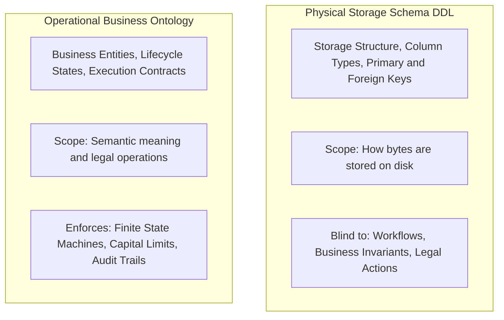
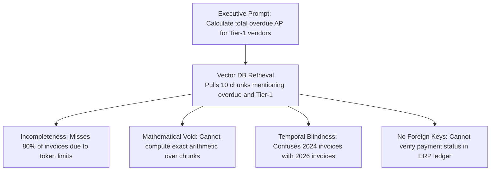
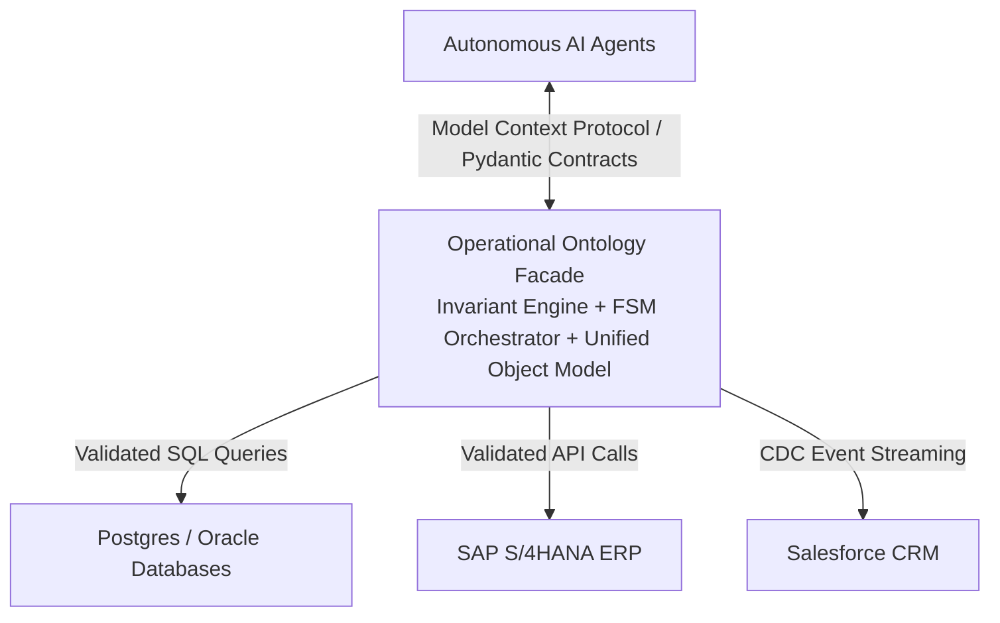

*Reading time: 13 minutes. Author: Hugo S. Nascimento.*

<!-- more -->

*Context: Over the past eighteen months, the tech industry has pushed two flawed architectures for enterprise AI: Text-to-SQL over relational databases and vector search over unstructured embeddings. Both collapse in production because neither captures business meaning, behavioral invariants, or permissible state transitions. This guide explains why raw database schemas fall short and how an operational ontology bridges the gap.*

---

## Executive Summary

When enterprise software teams attempt to give AI agents access to corporate data, they almost universally default to two patterns:

1. **The Vector Store Approach:** Embed enterprise documents and data records into a vector database, retrieving text chunks via cosine similarity.
2. **The Text-to-SQL Approach:** Dump the relational database schema (DDL) into the system prompt and let the LLM generate dynamic SQL queries on the fly.

Both patterns fail in production when applied to mission-critical operations.

- **Vector stores fall short** because semantic similarity is not relational truth. Embeddings cannot compute arithmetic, cannot join foreign keys, and cannot enforce statutory accounting periods.
- **Relational database schemas fall short** because DDL defines **storage constraints, not business semantics**. A database schema knows that `total_amount` is a `NUMERIC(12,2)`. It does not know what an invoice *means*, whether it is legally approved for payment, or what downstream events must fire when its status updates.

An **Operational Business Ontology** is the missing architectural tier. It wraps raw relational schemas in strongly typed business objects, compiled invariants, and executable state machines, ensuring that agents query and mutate enterprise data with 100% deterministic precision.

---

## The Illusion of Text-to-SQL: Why It Fails in Enterprise Production

The premise of Text-to-SQL sounds compelling to non-technical executives: connect an LLM to your Postgres or Snowflake database, pass the table schemas in the prompt, and let users ask questions in natural language.

In the real world of enterprise IT, pure Text-to-SQL fails for four structural reasons:

### 1. The Semantic Ambiguity Crisis
Ask three enterprise executives: *"How many active customers do we have?"*

- The **Head of Sales** considers an active customer anyone who signed a contract in the last twelve months.
- The **Head of Product** considers an active customer anyone who logged into the SaaS platform in the last thirty days.
- The **CFO** considers an active customer anyone who generated positive net revenue and has zero overdue invoices.

In a relational database, there is no `is_active_customer` boolean column that resolves this nuance. 

Instead, answering that question requires complex filtering across `contracts`, `user_sessions`, `billing_records`, and `disputes`. When an LLM generates raw SQL from schema definitions alone, it guesses which definition to use. In production, this produces wild metric discrepancies that destroy executive confidence.

### 2. The Cryptic Legacy Schema Problem
Enterprise software runs on systems like SAP ECC, SAP S/4HANA, AS400, or Totvs Protheus. 

These databases do not expose clean, human-readable column names. In a core accounting table like SAP's `BSEG` (Accounting Document Segment), columns appear as opaque technical abbreviations:

| Legacy SAP Column | Data Type | Business Meaning |
| :--- | :--- | :--- |
| `MANDT` | `VARCHAR(3)` | Client / Mandant identifier |
| `BUKRS` | `VARCHAR(4)` | Company code |
| `BELNR` | `VARCHAR(10)` | Accounting document number |
| `GJAHR` | `NUMERIC(4)` | Fiscal year |
| `BUZEI` | `NUMERIC(3)` | Number of line item within document |
| `SHKZG` | `VARCHAR(1)` | Debit / Credit indicator (`S` = Debit, `H` = Credit) |
| `DMBTR` | `NUMERIC(13,2)` | Amount in local currency |
| `KOART` | `VARCHAR(1)` | Account type (`D` = Customer, `K` = Vendor, `S` = G/L) |

An LLM inspecting `BSEG` has no intrinsic understanding of what `MANDT`, `BUKRS`, or `SHKZG` represent in the context of corporate accounting. Feeding thousands of pages of SAP data dictionary documentation into context windows blows token budgets and produces catastrophic hallucination rates.

### 3. Lack of Business Invariants
Relational database schemas enforce technical constraints (such as `NOT NULL` or foreign key references), but they are blind to dynamic business invariants.

For example, consider an orders table storing `order_id`, `customer_id`, `status`, and `total_amount`. As far as the relational database engine is concerned, executing an update setting `status` from `PENDING` directly to `REFUNDED` without ever moving through `PAID` or `FULFILLED` is completely valid SQL. The database accepts the write. The business ledger is now corrupted.

A database schema cannot enforce the temporal logic of an enterprise workflow. That logic belongs in an operational ontology.

### 4. Denial of Service via Unbounded Queries
Giving an agent raw SQL write or execution permissions is an operational vulnerability. 

An autonomous agent attempting to answer a broad question may inadvertently generate an unindexed cross-table join across fifty million rows—for example, scanning every historical order with full-text wildcards (`ILIKE '%urgent%'`) grouped by customer name.

This query exhausts database memory buffers, triggers CPU throttling, locks production tables, and takes down live customer-facing applications.

---

## Why Vector Stores Cannot Save You

When teams realize Text-to-SQL is fragile, they frequently swing to the other extreme: vector databases and Retrieval-Augmented Generation (RAG).

Vector databases are exceptional for finding conceptually related text passages across unstructured PDF libraries. They are completely incapable of structured enterprise execution.

Vector databases operate on **probabilistic linguistic proximity**. Enterprise operations require **exact relational and mathematical determinism**.

---

## Technical Comparison: DDL vs. Operational Ontology

The following matrix clarifies the architectural boundary between physical database schemas and an operational business ontology:

| Architectural Metric | Relational Schema (DDL) | Operational Business Ontology |
| :--- | :--- | :--- |
| **Primary Abstraction** | Tables, Columns, Foreign Keys, Indexes | Business Entities, Invariants, Actions, States |
| **Level of Representation** | Physical Storage Layer | Semantic Operational Layer |
| **Language** | SQL (PostgreSQL, Oracle, Snowflake) | Python (Pydantic), TypeScript, Rust |
| **Constraint Enforcement** | Primitive Types, Nullability, Foreign Keys | Complex mathematical rules, Temporal Logic, FSMs |
| **Execution Primitives** | Raw SQL Queries (`SELECT`, `INSERT`, `UPDATE`) | Parameterized Action Tools (MCP Endpoints) |
| **Multi-System Synthesis** | None (Isolated to single database instance) | Synthesizes across ERP, CRM, WMS, and Billing |
| **Agent Interface** | Dangerous (Direct SQL generation) | Safe (Strictly typed, validated function calls) |
| **Auditability** | Database WAL / CDC logs (Technical diffs) | Cryptographic business audit events (Who/Why/What) |

---

## Architectural Comparison: Why Relational DDL Fails Where Ontology Succeeds

Consider an enterprise operational requirement:
*An enterprise cannot issue a credit memo to a customer if the customer's account is currently under legal dispute, or if the credit memo amount exceeds 15% of the total original order value.*

### Approach 1: The Raw Relational Table Approach (Fragile)

Under a standard relational database setup, a `credit_memos` table stores `order_id`, `customer_id`, `amount`, and `created_at`.

When an autonomous agent generates a raw SQL statement inserting an unauthorized $45,000 credit memo against a $50,000 order for an account under active litigation:

- **The Database Accepts the Row:** The foreign keys are valid UUIDs, and the numeric field is a valid decimal.
- **The Ledger is Corrupted:** The database engine has zero built-in mechanism to evaluate customer dispute status or calculate cross-record concession ratios.

### Approach 2: The Operational Ontology Approach (Bulletproof)

In an operational ontology, the agent is never given direct SQL insert privileges. It must call an **Ontological Action Contract** (`IssueCreditMemoRequest`):

| Action Parameter | Type & Constraint | Evaluated Invariant Gate |
| :--- | :--- | :--- |
| `order_id` | String / UUID | Must map to an existing, settled corporate sales order. |
| `customer_id` | String / UUID | Reconciled against master customer compliance ledger. |
| `original_order_amount` | Decimal (> 0) | Exact monetary value extracted from original order record. |
| `requested_credit_amount` | Decimal (> 0) | **Concession Ceiling Invariant:** Cannot exceed 15% of `original_order_amount`. Amounts above ceiling trigger hard validation abortion. |
| `customer_legal_status` | Enum (`CLEAR`, `UNDER_REVIEW`, `LEGAL_DISPUTE`) | **Statutory Legal Blocker:** If status is `LEGAL_DISPUTE`, all automated concessions are legally frozen. |

### Why This Protects the Enterprise

When the LLM attempts to generate the action:

1. If the customer is in dispute, the contract raises an immediate statutory permission rejection.
2. If the amount requested is $45,000 against a $50,000 order, the invariant validator aborts before any transaction starts.
3. The database connection is never even contacted.
4. The exact failure reason is returned to the agent context loop, allowing the model to respond intelligently: *"I cannot issue this credit memo: customer is flagged under legal dispute and the amount exceeds our 15% concession ceiling."*

---

## Architectural Recommendation: The Ontology Facade Pattern

For enterprise CTOs and Heads of Data, you do not need to rewrite your underlying legacy databases to achieve this safety.

The industry standard architecture in 2026 is the **Ontology Facade Pattern**:

1. **Keep your existing databases intact:** Do not touch your core SAP, Postgres, or Oracle tables.
2. **Build an intermediate Ontology Layer in Python/FastMCP:** Map the tables into unified domain objects with explicit business invariants and finite state machines.
3. **Restructure Agent Tooling:** Never give agents raw SQL connections. Give agents access to the typed tools exposed by your Ontology Facade.

---

## Conclusion: Meaning Over Storage

Data tables are passive storage arrays. Vector stores are probabilistic text indices. Neither understands the legal, financial, and operational reality of your business.

If you connect autonomous AI agents directly to database tables, you will spend your engineering budget firefighting hallucinated SQL joins, data corruption, and catastrophic edge-case failures.

To build autonomous agents that can be trusted with corporate balance sheets:

- Stop treating database schemas as business logic.
- Stop treating vector similarity as relational truth.
- Build an **Operational Business Ontology** as the semantic and behavioral gatekeeper of your enterprise.

---

*At HSN Labs, we build production-grade operational ontologies that wrap enterprise legacy databases and power autonomous agent architectures. To assess your current data architecture and deploy an executable ontology in five days, book our on-site [Agentic Architecture Bootcamp](https://hsnlabs.ai/bootcamp).*

## Strategic Resources and Related Essays
- <a href="../what-is-an-ontology-for-ai-agents/">What Is an Ontology for AI Agents? The Definitive Guide</a>
- <a href="../palantir-vs-databricks-agent-architecture/">Palantir vs Databricks: Why Data Lakes Fail at Agent Orchestration</a>
- <a href="../the-poc-graveyard/">Why Agents Fail: The PoC Graveyard</a>
- <a href="https://hsnlabs.ai/bootcamp">Apply for the HSN Labs Five-Day Architecture Bootcamp</a>