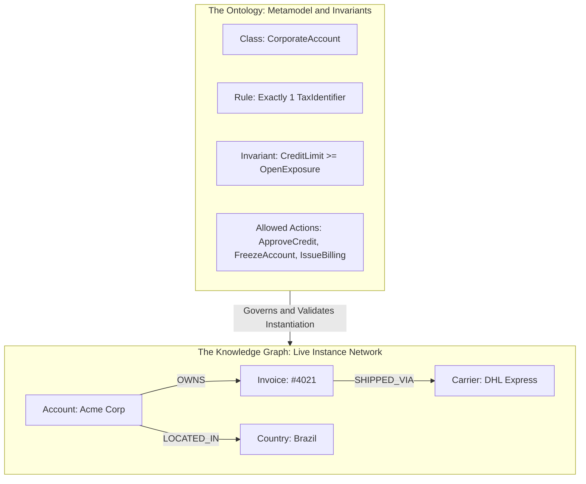
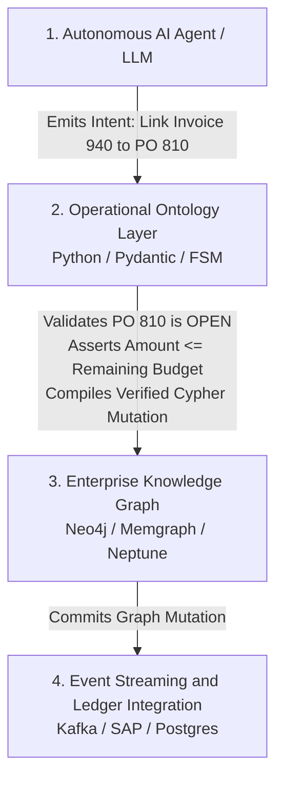

*Reading time: 12 minutes. Author: Hugo S. Nascimento.*

<!-- more -->

*Context: Over the last twenty-four months, enterprise data teams have burned millions of dollars building sprawling graph databases that nobody queries and autonomous agents cannot navigate. The root cause is a fundamental category error: confusing an ontology with a knowledge graph. This guide establishes the clear technical distinction, the architectural coupling between both layers, and how to deploy them together in production.*

---

## Executive Summary

Enterprise data teams frequently use the terms *ontology* and *knowledge graph* interchangeably. In production engineering, conflating them causes immediate architectural failure.

Here is the exact difference:

- An **Ontology** is the **schema, logic, and rule system**. It defines the abstract types, valid relationships, mathematical invariants, and permissible state transitions of your business. It is the type definition in code.
- A **Knowledge Graph** is the **network of concrete instances and facts**. It instantiates those abstract types with live enterprise records (specific customers, actual invoices, real hospital beds, physical shipping containers) and connects them via directed edges. It is the object instance living in memory.



You cannot build a functional knowledge graph for autonomous AI agents without a strict operational ontology. 

If you build a graph without an ontology, you create **graph drift**—a massive, unindexed swamp of conflicting edge types, broken constraints, and hallucinated relationships that no language model can traverse reliably.

---

## The Software Engineering Analogy: Types vs. Heap Memory

If you have a background in systems programming, the distinction is straightforward:

| Dimension | Operational Ontology | Enterprise Knowledge Graph |
| :--- | :--- | :--- |
| **Object-Oriented Analogy** | Class definition, Interface, Type contract | Instantiated object in heap memory |
| **Relational DB Analogy** | DDL (Data Definition Language) + Triggers | Table rows and foreign key relationships |
| **Compiler Analogy** | Type checker and static analyzer | Runtime execution state |
| **Mutational Velocity** | Low (Changes when business logic changes) | High (Changes with every transaction) |
| **Size in Bytes** | Megabytes (Code definitions and constraints) | Gigabytes to Terabytes (Billions of facts) |
| **Primary Failure Mode** | Logical contradiction, unmapped edge cases | Graph drift, dangling edges, orphan nodes |

The ontology answers: *"What constitutes a valid commercial transaction in this corporation, and under what conditions can state mutate?"*

The knowledge graph answers: *"Which specific commercial transactions took place between Supplier X and Subsidiary Y during the third fiscal quarter?"*

---

## Anatomy of a Knowledge Graph: Nodes, Edges, and Properties

A knowledge graph organizes enterprise information as a property graph or an RDF triple store. In production agent stacks, the modern standard is the **Labeled Property Graph** (implemented in engines like Neo4j, Memgraph, or AWS Neptune).

A property graph consists of three mathematical elements:

```
(Node: Source) ---[Directed Edge: Relationship {Properties}]---> (Node: Target)
```

1. **Nodes (Vertices):** Discrete entity instances (e.g., `Customer: "Global Logistics Ltd"`, `Part: "Hydraulic Valve X9"`, `Facility: "Warehouse 04"`).
2. **Directed Edges (Relationships):** Explicit semantic connections connecting two nodes with directionality (e.g., `[:SUPPLIES]`, `[:ASSEMBLED_IN]`, `[:PAID_BY]`).
3. **Properties (Key-Value Attributes):** Concrete metadata stored on nodes and edges (e.g., `weight_kg: 4.5`, `transaction_timestamp: 1774790400`, `interest_rate: 0.085`).

### Why Knowledge Graphs Alone Fail Autonomous Agents

Knowledge graphs excel at multi-hop relational retrieval. When an engineer asks: *"Which Tier-2 suppliers provide subcomponents to the assembly line that experienced downtime yesterday?"*, a graph engine traverses edges in milliseconds. A relational database would choke on a seven-way SQL join.

However, knowledge graphs have zero inherent operational execution capabilities.

- A graph node does not know if an invoice is legally payable.
- An edge cannot prevent an AI agent from writing an invalid relationship into the database.
- A graph engine cannot enforce finite state machine transitions without external validation code.

If you connect an LLM directly to a raw knowledge graph with write permissions, the model will invent arbitrary edge types (e.g., creating `[:PARTIALLY_SETTLED_MAYBE]` alongside `[:SETTLED]`), corrupting the graph taxonomy within weeks.

---

## The Dual-Stack Architecture: Coupling the Graph to the Ontology

In enterprise production, the ontology sits as the compiler and governor directly above the knowledge graph. 

Every node creation, edge traversal, and state mutation attempted by an AI agent must pass through the ontology's validation harness before hitting the graph storage engine.



---

## Code Walkthrough: Enforcing Ontological Contracts on a Graph

The following production pattern demonstrates how an operational ontology written in Python with Pydantic intercepts and governs mutations on a property graph.

```python
from datetime import datetime
from decimal import Decimal
from enum import Enum
from typing import Optional
from pydantic import BaseModel, Field, model_validator


class PurchaseOrderStatus(str, Enum):
    DRAFT = "DRAFT"
    APPROVED = "APPROVED"
    FULFILLED = "FULFILLED"
    CLOSED = "CLOSED"


# 1. ONTOLOGY CONTRACT (The Rule System)
class RelationalLinkInvoiceToPOContract(BaseModel):
    invoice_id: str
    purchase_order_id: str
    invoice_amount: Decimal = Field(gt=0)
    po_remaining_balance: Decimal = Field(ge=0)
    po_status: PurchaseOrderStatus

    @model_validator(mode="after")
    def validate_business_invariants(self) -> "RelationalLinkInvoiceToPOContract":
        # Invariant 1: State Machine check
        if self.po_status != PurchaseOrderStatus.APPROVED:
            raise ValueError(
                f"Ontology Violation: Cannot link invoice to Purchase Order in state '{self.po_status}'. "
                "Target PO must be in 'APPROVED' state."
            )
        
        # Invariant 2: Financial Balance Sheet Invariant
        if self.invoice_amount > self.po_remaining_balance:
            raise ValueError(
                f"Ontology Violation: Invoice amount (${self.invoice_amount}) exceeds "
                f"remaining PO balance (${self.po_remaining_balance}). "
                "Transaction rejected to prevent ledger overrun."
            )
        return self


# 2. GRAPH ADAPTER (The Execution Engine)
class EnterpriseGraphAdapter:
    """
    Executes compiled, validated Cypher queries against the Property Graph.
    Guarantees zero raw, unvalidated LLM queries touch the graph directly.
    """
    def __init__(self, graph_session):
        self.session = graph_session

    def execute_verified_link(self, contract: RelationalLinkInvoiceToPOContract) -> dict:
        cypher_query = """
        MATCH (inv:Invoice {id: $invoice_id})
        MATCH (po:PurchaseOrder {id: $po_id})
        CREATE (inv)-[rel:MATCHES_PURCHASE_ORDER {
            linked_at: $timestamp,
            settled_amount: $amount
        }]->(po)
        SET po.remaining_balance = po.remaining_balance - $amount
        RETURN inv.id AS invoice_id, po.id AS po_id, rel.linked_at AS timestamp
        """
        parameters = {
            "invoice_id": contract.invoice_id,
            "po_id": contract.purchase_order_id,
            "amount": float(contract.invoice_amount),
            "timestamp": datetime.utcnow().isoformat()
        }
        
        # Execute query deterministically
        return {"status": "SUCCESS", "parameters": parameters}
```

### Why This Eliminates Agent Runtime Failures

If an LLM hallucinates and attempts to bind a $50,000 invoice to an approved Purchase Order that only has $12,000 remaining in allocated budget, what happens?

In an unconstrained architecture, the agent writes the edge into the database, silently corrupting corporate books.

In this ontology-governed architecture:

1. The `model_validator` executes before any database connection is opened.
2. The assertion `invoice_amount > po_remaining_balance` triggers a hard `ValueError`.
3. The execution aborts. The graph state remains pure.
4. The exact error message is serialized and injected back into the LLM context loop, allowing the agent to self-correct: *"PO balance insufficient. Escalating discrepancy to procurement officer."*

---

## Comparison Matrix: The Enterprise Data Landscape

Understanding where each storage and modeling paradigm fits across the enterprise architecture:

| Architectural Metric | Relational DB (Postgres/SQL) | Vector DB (Pinecone/Milvus) | Knowledge Graph (Neo4j) | Operational Ontology |
| :--- | :--- | :--- | :--- | :--- |
| **Primary Data Model** | Tables, Rows, Foreign Keys | High-dimensional embedding vectors | Nodes, Directed Edges, Properties | Object Schemas, State Machines, Invariants |
| **Best Query Type** | Exact transactional lookups (CRUD) | Fuzzy semantic search, natural text match | Multi-hop relationship discovery, lineage | Pre-condition checks, state transitions |
| **Arithmetic Integrity** | 100% Deterministic | Zero (Approximated) | 100% Deterministic | 100% Deterministic |
| **Dynamic Execution** | Stored Procedures / Triggers | None (Passive index) | Stored Procedures (Limited) | Native Code (MCP, Python, Rust) |
| **Reasoning Support** | Rigid, requires static schema | Probabilistic, unstructured | Graph traversals, pattern matching | Formal business constraint validation |
| **Role in Agent Stack** | Core transactional record | Document memory & retrieval | Entity relational discovery | Brain-to-system safety harness |

---

## Enterprise Use Cases: When to Deploy Both

### 1. Healthcare: Protocol Adherence & Clinical Trial Matching

* **The Knowledge Graph:** Maps the patient history, previous diagnoses, prescribed pharmaceuticals, genetic markers, and clinical trial eligibility criteria across hospital networks.
* **The Operational Ontology:** Enforces statutory FDA protocols, drug-drug interaction contraindications, and patient consent invariants. An agent can discover experimental trials via the graph, but the ontology strictly forbids scheduling an enrollment action if contraindications exist.

### 2. Banking: Anti-Money Laundering & Sanctions Screening

* **The Knowledge Graph:** Traces synthetic identity networks, multi-layered shell corporation ownership chains, and shared bank account endpoints across millions of wire transfers.
* **The Operational Ontology:** Governs statutory regulatory reporting (FinCEN, COAF), freezes accounts under legal injunctions, and calculates risk exposure metrics with certified decimal precision.

### 3. Supply Chain: Resilient Disruption Routing

* **The Knowledge Graph:** Models deep Tier-1, Tier-2, and Tier-3 supplier dependencies, maritime shipping lanes, port customs bottlenecks, and warehouse inventory counts.
* **The Operational Ontology:** Defines what constitutes an authorized emergency re-routing action, validates alternative supplier credit ratings, and automatically triggers contractual price escalation clauses within legal thresholds.

---

## Conclusion: Stop Building Graphs Without Rules

Building a knowledge graph without an operational ontology is the enterprise software equivalent of deploying an un-typed programming language into production with zero tests. It looks impressive in internal demo recordings, but it breaks the moment it touches real corporate data.

The formula for resilient, mission-critical autonomous agents is clear:

1. Model your **business entities, invariants, and action state machines** in code as an **Operational Ontology**.
2. Connect your **multi-source relational records and dependency networks** as a **Knowledge Graph**.
3. Force every agent action to **compile through the ontology before mutating the graph or the underlying ERP**.

This neuro-symbolic separation is what separates brittle toy chatbots from enterprise-grade autonomous systems that generate verifiable economic return.

---

*At HSN Labs, we engineer custom operational ontologies and resilient graph architectures for enterprise operations. To audit your AI agent infrastructure or deploy production-grade systems in five days, review our on-site [Agentic Architecture Bootcamp](https://hsnlabs.ai/bootcamp).*

## Strategic Resources and Related Essays

- <a href="../how-to-build-an-enterprise-ontology-from-scratch/">How to Build an Enterprise Ontology from Scratch: Step by Step</a>
- <a href="../the-operational-ontology/">The Operational Ontology: How Enterprises Connect LLMs to Proprietary State</a>
- <a href="../palantir-aip-bootcamp-operational-ontology/">The Architecture of Palantir AIP: Why Enterprise Agents Require an Operational Ontology</a>
- <a href="https://hsnlabs.ai/bootcamp">Apply for the HSN Labs Five-Day Architecture Bootcamp</a>
