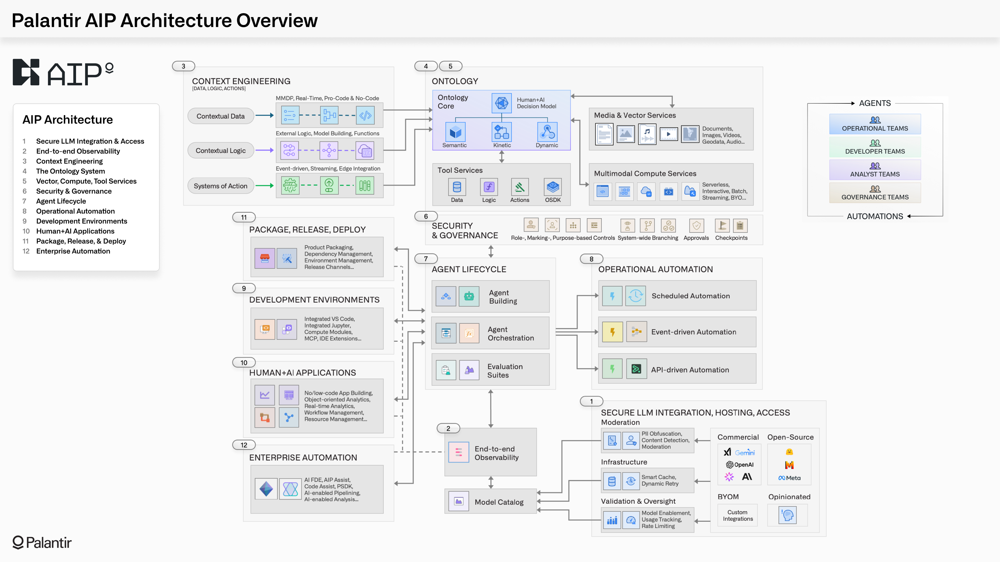

*Reading time: 5 minutes. Author: Hugo S. Nascimento.*

Enterprise AI software has an 85% death rate between proof of concept and production.

Enterprises hire systems integrators to build chatbots. The integrators spend six months writing PowerPoint slide decks, connecting large language models directly to raw SQL databases or vector search indices. 

The moment an autonomous model touches a production ledger, it hallucinates an invalid foreign key, executes a hallucinated transaction, and crashes. The C-suite freezes CapEx and cancels the initiative.

Palantir inverted this entire economic and technical dynamic with its AIP Bootcamp.[1]

Instead of running nine-month exploratory enterprise sales cycles, Palantir deploys forward-deployed software engineers directly into client infrastructure to deliver working production workflows in five days.[1][2]

Here is the technical reality of why AIP bootcamps work, why most generative AI pilots fail, and how forward-deployed engineering de-risks enterprise AI adoption.

---

## 1. The Core Flaw: Connecting Models to Data Without an Ontology

Traditional enterprise software architecture relies on point-to-point integration. 

When developers build generative AI agents, they usually wire an LLM directly to an API or database via retrieval-augmented generation. 

This architecture fails in enterprise environments for three mathematical reasons:

1. **Schema Semantic Drift:** Enterprise databases are messy. Column names like `STATUS_CD_04` or `VNDR_BAL_NET` carry decades of institutional tribal knowledge that model context windows cannot decipher reliably.
2. **Missing Transactional Invariants:** A raw foundation model has no concept of double-entry ledger balancing, regulatory holding periods, or medical compliance thresholds.
3. **Unbounded Action Execution:** Giving an autonomous model unconstrained tool-calling permissions against an ERP database guarantees operational corruption.

Palantir does not connect LLMs to raw database tables. Palantir binds LLMs to an **Operational Ontology**.[3]

An ontology is not a vector database. It is a digital twin of enterprise business logic written in strict software:

- **Objects:** Real-world entities such as patients, hospital beds, supply orders, or shipping containers.
- **Properties:** Verified schema attributes extracted from disparate systems of record.
- **Actions:** Code-level state transitions and APIs that enforce business rules and authorization controls before any database mutation occurs.

When an AI agent operates through an ontology, the model does not write raw database mutations. The model selects typed, bounded actions governed by strict deterministic rules.

<figure class="article-editorial-figure">
  
  <figcaption class="editorial-caption">Palantir AIP official architecture diagram: connecting legacy systems of record, operational ontology entities, and bounded autonomous actions.</figcaption>
</figure>

---

## 2. Tampa General Hospital: 83% Reduction in Placement Delay

The power of binding autonomous models to an operational ontology is visible in regulated healthcare.

Tampa General Hospital operates over 1,000 acute care beds.[3] 

In a traditional hospital setting, managing patient admissions and bed allocations requires nurse managers to spend several hours every shift navigating disconnected spreadsheets and making manual phone calls across clinical units.

Tampa General deployed Palantir Foundry and AIP to integrate nurse scheduling, electronic health record telemetry, and surgical calendars into a unified hospital ontology.[3]

The results demonstrate the difference between conversational wrappers and production agent architecture:

- **83% reduction in time spent managing patient placements.**[3]
- **28% reduction in patient hold time in the Post-Anesthesia Care Unit.**[3]
- **30% improvement in nurse staffing ratios.**[3]

The agent does not generate creative medical advice. The agent monitors real-time patient admissions against bed capacity invariants, predicts transfer bottlenecks, and routes surgical queues directly to hospital decision-makers.

---

## 3. Why the 5-Day Bootcamp De-Risks Enterprise CapEx

In their official 2023 Form 10-K filing with the U.S. Securities and Exchange Commission, Palantir explicitly documented the strategic purpose of their bootcamp go-to-market motion:

> "Beginning in 2023, we introduced AIP bootcamps to the initial stages of our customer acquisition process, which helped to accelerate these discussions and provide an opportunity for our customers to experience our platforms through their own use cases in days."[1]

The economics of enterprise procurement are broken:

- Systems integrators charge millions of dollars on time-and-materials contracts to produce advisory documentation.
- Enterprise CIOs and CFOs are paralyzed by the risk of funding multi-quarter technology migrations that fail in code.

The bootcamp eliminates speculative technical risk. By delivering functional workflows on customer data within 120 hours, the economic buyer evaluates working software rather than corporate promises.[1][2]

---

## 4. Building the Operational Ontology Without Vendor Lock-In

While Palantir has proven the validity of ontology-first agent engineering, enterprises face a major structural barrier: multi-million-dollar annual software licensing commitments and proprietary platform lock-in.

Mid-market enterprises and cost-conscious corporations do not need seven-figure proprietary platforms to achieve production agent reliability. 

At HSN Labs, we execute the same fundamental engineering blueprint using modular, open enterprise architecture:

1. **Domain Ontology Mapping:** Reverse-engineering corporate databases into Pydantic data contracts and graph relations.
2. **Deterministic State Perimeters:** Wrapping autonomous reasoning graphs in formal finite state machines.
3. **Five-Day Architecture Sprint:** Deploying an isolated sandbox prototype on real corporate data to prove audited unit ROI before production rollout.

If you connect foundation models to raw enterprise data without a strict operational ontology, your agents will fail in production. 

If you bind autonomous agents to code-level software guards and typed business objects, you eliminate hallucinations and unlock operational scale.

---

## Sources

[1] https://www.sec.gov/Archives/edgar/data/1321655/000132165524000022/pltr-20231231.htm — Palantir Technologies Inc. Form 10-K Annual Report
[2] https://www.palantir.com/platforms/aip/bootcamp — Palantir AIP Bootcamp: From 0 to Use Case in 5 Days
[3] https://www.palantir.com/impact/tampa-general-hospital — Tampa General Hospital Case Study: Infusing Data Throughout the Care Continuum

## Strategic Resources and Related Essays
- <a href="../how-to-build-an-enterprise-ontology-from-scratch/">How to Build an Enterprise Ontology from Scratch: Step by Step</a>
- <a href="../perimeter-isolation-mcp-data-contracts/">How We Protect Enterprise Databases from AI Agents</a>
- <a href="../legacy-core-backing-engine/">Legacy Core Systems Will Not Die: They Are the Execution Engine</a>
- <a href="https://hsnlabs.ai/bootcamp">Apply for the HSN Labs Five-Day Architecture Bootcamp</a>