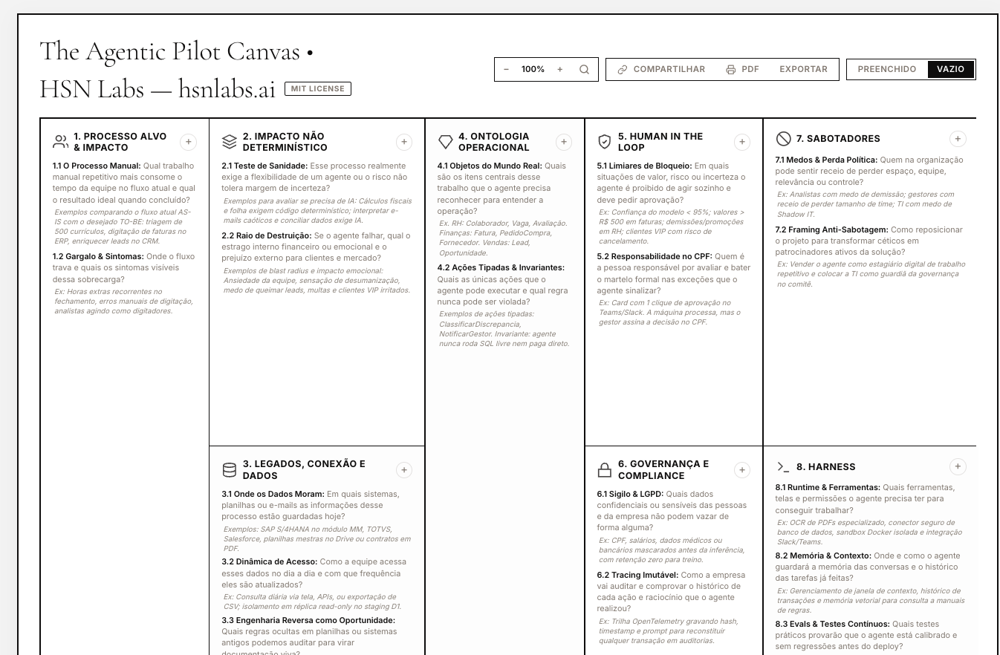
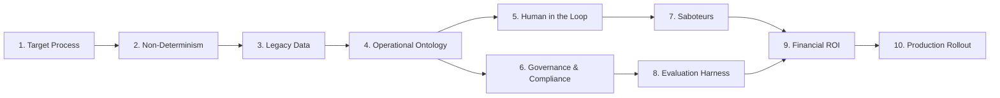

*Reading time: 5 minutes. Author: Hugo S. Nascimento.*

<!-- more -->

Most enterprise AI pilots collapse before production. Not because foundation models lack intelligence, but because teams lack engineering specifications.

Teams build brittle demos powered by free-form system prompts. Once the agent meets legacy relational databases, zero-tolerance financial workflows, and undocumented enterprise policies, the deployment fails.

To solve this architectural gap before committing code, I designed and released The Agentic Pilot Canvas under the open MIT License.

Version 1.4, updated in October 2026, codifies the production lessons from our engineering sprints at HSN Labs. The framework runs natively in the browser:

👉 **Launch interactive canvas:** [hsnlabs.ai/canvas](https://hsnlabs.ai/canvas/)

---

---

## The Dependency Chain

An enterprise pilot never starts with model selection. It follows a deterministic ten-stage sequence:

---

## The 10 Blocks of the Framework

1. **Target Process & Impact:** Pinpoint the repetitive manual bottleneck. Keep pilots strictly internal.
2. **Non-Deterministic Impact:** Verify whether the workflow demands stochastic inference or deterministic code. Define blast radius boundaries.
3. **Legacy Systems & Data:** Map where state lives — SAP, TOTVS, Salesforce, or master spreadsheets. Reverse engineer legacy rules into typed specifications.
4. **Operational Ontology:** Declare real-world domain objects and strongly-typed actions. The agent never executes raw SQL.
5. **Human in the Loop:** Enforce formal approval thresholds for high-risk mutations.
6. **Governance & Compliance:** Anonymize PII prior to inference and record immutable OpenTelemetry traces.
7. **Saboteurs & Organizational Alignment:** Mitigate political friction by framing agents as digital apprentices handling low-level toil.
8. **Evaluation Harness:** Run automated regression suites against hundreds of benchmark scenarios before release.
9. **Financial ROI:** Prove net margin expansion on the P&L after factoring token consumption and infrastructure overhead.
10. **Rollout Trigger:** Define explicit five-day sandbox gates that unlock production deployment upon reaching agreed accuracy thresholds.

---

## Interactive Tooling

The framework includes:
* **Blank Mode:** Clean sheet for live executive scoping workshops.
* **Filled Benchmark:** Production case study integrated into legacy enterprise systems.
* **Tooling:** Local browser persistence, presentation loupe, and one-click PDF export.

Open the tool at [hsnlabs.ai/canvas](https://hsnlabs.ai/canvas/) to architect your next production agent.
