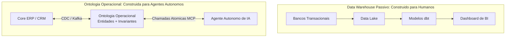
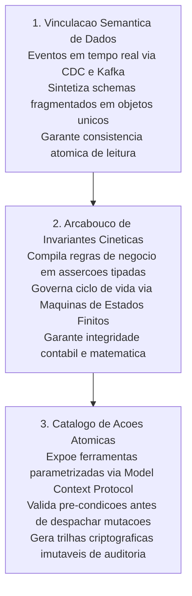
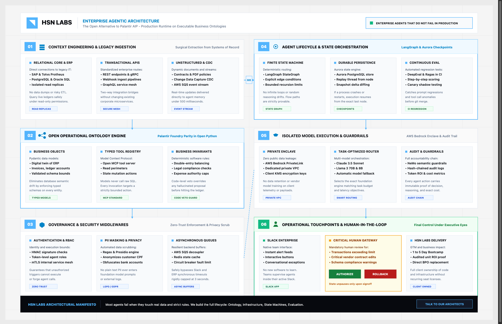
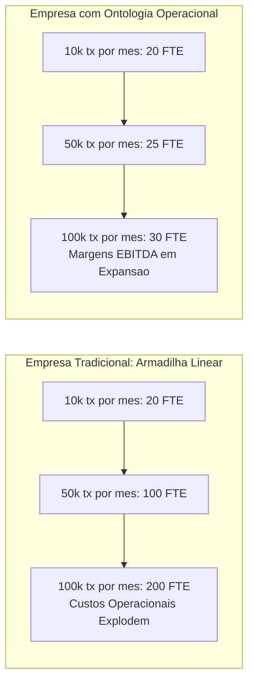

*Tempo de leitura: 7 minutos. Autor: Hugo S. Nascimento.*

<!-- more -->

*Contexto: Este post estabelece o manifesto conceitual e técnico da HSN Labs. A ontologia operacional é a peça ausente que explica por que noventa por cento dos projetos de agentes corporativos fracassam e como os dez por cento restantes vencem.*

A inteligência artificial generativa resolveu o problema da compreensão e geração de linguagem natural. No entanto, linguagem solta não move frotas, não líquida faturas e não renegocia contratos de crédito.

Para que um sistema autônomo tenha utilidade real dentro de uma corporação de grande porte, ele precisa de uma ponte estrita que traduza probabilidade em determinismo operacional. Essa ponte é a Ontologia Operacional.

---

## Os Três Elementos Inseparáveis da Ontologia

Uma ontologia operacional completa e composta por três camadas indissociáveis:

### 1. O Modelo Semântico de Entidades
Representa os substantivos da empresa. Não são meras tabelas de banco de dados, mas conceitos de domínio unificados que agregam dados de ERPs legados, CRMs e planilhas em objetos de negócios coerentes com histórico e linhagem auditável.

### 2. O Grafo de Regras e Invariantes
Representa os adjetivos e restrições da organização. São as políticas corporativas, regulamentos de compliance e leis fiscais que delimitam o que pode e o que não pode acontecer em cada transação.

### 3. A Matriz de Ações Executáveis
Representa os verbos da companhia. São as ferramentas e operações mutáveis que o agente tem permissão de acionar no ecossistema de produção, sempre acompanhadas de pre-condições matemáticas e validadores de segurança.

<figure class="article-editorial-figure">
  
  <figcaption class="editorial-caption">Arquitetura agêntica enterprise de ponta a ponta: ingestão cirúrgica de legados, ontologia operacional aberta, middlewares de governança, ciclo de vida com máquinas de estados e supervisão humana.</figcaption>
</figure>

---

## Contrato de Ação Operacional Governamental

## Contrato Operacional de Ação via Model Context Protocol

Em uma ontologia operacional de logística portuária, agentes autônomos recebem capacidades de execução governadas por contratos rígidos de ferramentas denominado reencaminhar_container_porto:

| Parâmetro da Ação | Tipo e Restrição | Invariante de Segurança e Regra Operacional |
| :--- | :--- | :--- |
| `container_id` | Padrão `^CONT-[0-9]{6}$` | Identificador padronizado do container ativo. |
| `porto_destino_novo` | Enum SANTOS, PARANAGUA ou ITAJAI | Restrito a portos homologados com berço disponível. |
| `custo_desvio_estimado` | Numérico teto de 50 mil reais | **Teto de Autonomia:** Desvios com custo acima de R$ 50.000 exigem aprovação manual de alçada. |
| `aprovador_humano` | Identificador auditável | Assinatura de auditoria quando houver intervenção humana na alçada. |

---

## A Armadilha de Contratação Linear

Empresas tradicionais sofrem da armadilha de custos lineares: se o volume de transações cresce, o quadro operacional precisa crescer na mesma proporção. A ontologia operacional quebra essa barreira ao permitir automação com segurança matemática:

---

## Por Que Essa Abordagem Vence em Produção

Sem essa arquitetura, o modelo de linguagem atua como um funcionário recem-contratado que recebe acesso irrestrito ao banco de dados sem nenhum manual de procedimentos. Ele inevitavelmente comete erros graves de interpretação.

Ao operar sobre uma ontologia operacional, o agente recebe um contexto milimetricamente desenhado para sua missão, com todas as regras de negócio pré-compiladas em validadores determinísticos.

O resultado é software de inteligência artificial confiável, rápido e pronto para operar nos setores mais regulados da economia global.

## Recursos Estrategicos e Posts Relacionados
- <a href="/blog/pt/post/como-construir-ontologia-enterprise-do-zero/">Como Construir uma Ontologia Enterprise do Zero: Passo a Passo</a>
- <a href="/blog/pt/post/como-construir-ontologia-operacional-python-mcp/">Como Construir uma Ontologia Operacional de Negocios em Python e MCP</a>
- <a href="/blog/pt/post/ontologia-vs-grafo-conhecimento/">Ontologia vs Grafo de Conhecimento: Diferencas Chave e Arquitetura</a>
- <a href="https://hsnlabs.ai/pt/bootcamp/">Aplicar para o Bootcamp de Agentes Enterprise de 5 Dias da HSN Labs</a>