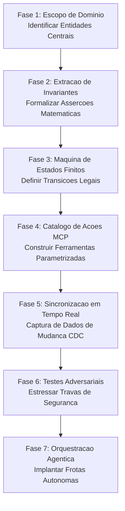
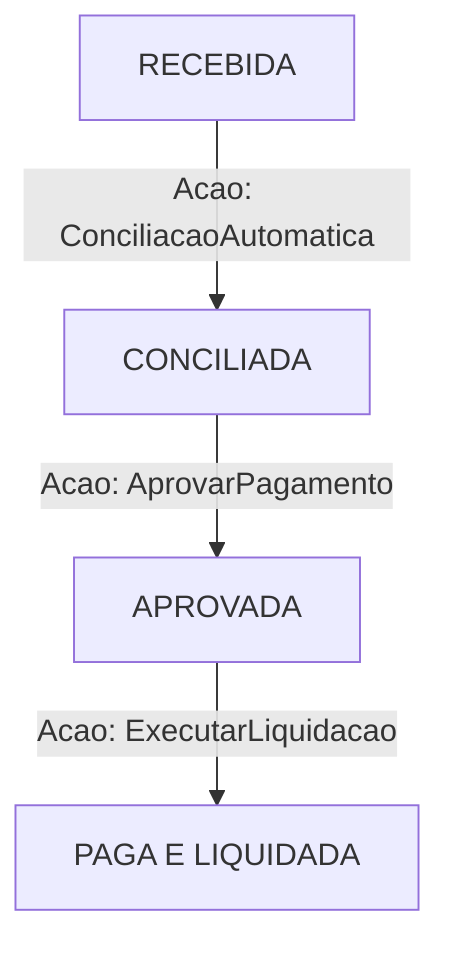
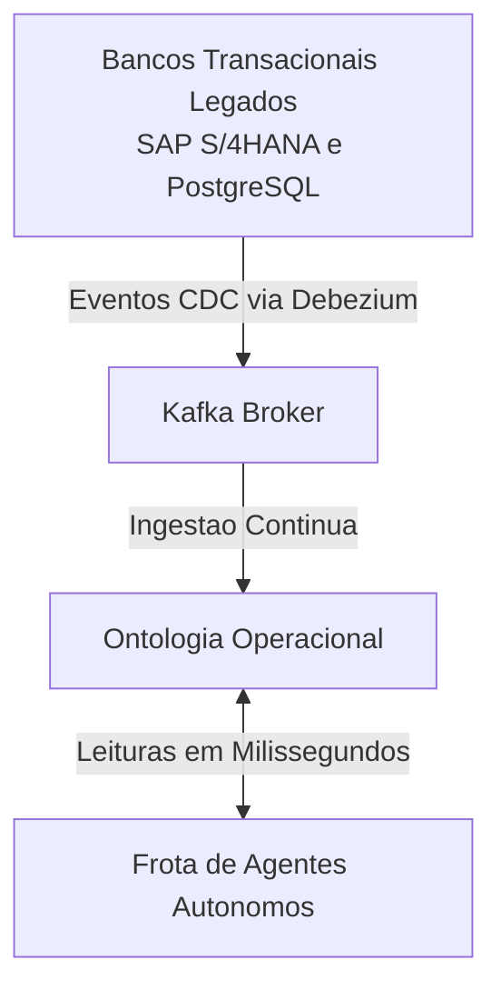
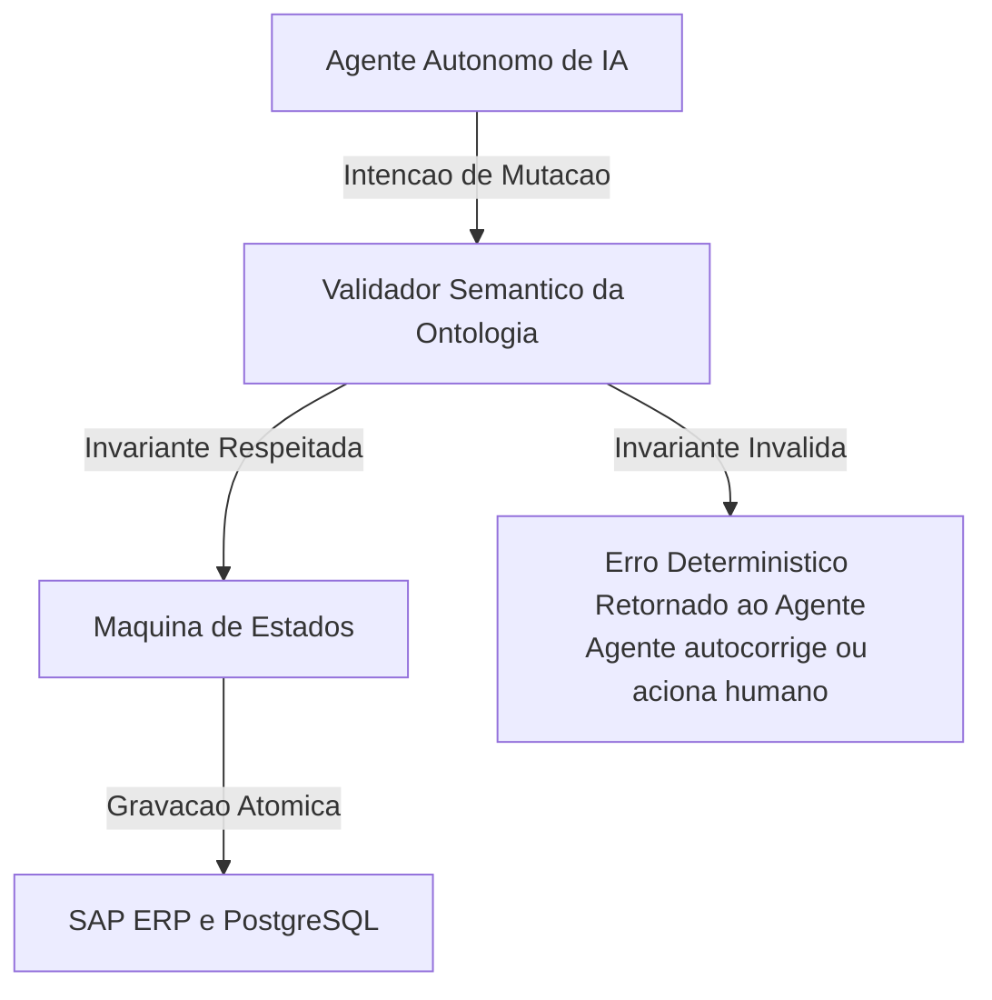

*Tempo de leitura: 8 minutos. Autor: Hugo S. Nascimento.*

<!-- more -->

*Contexto: Todo projeto de agentes na HSN Labs começa no mesmo lugar: desenhando a ontologia operacional do cliente. Sem essa fundação de dados e regras, nenhum modelo de linguagem consegue atuar de forma segura no mundo corporativo.*

A maioria das iniciativas de IA começa escolhendo qual modelo de linguagem utilizar ou configurando bancos vetoriais. Essa é a ordem inversa da boa engenharia de software.

Se os sistemas centrais da sua empresa não possuírem uma representação formal e clara do que é um cliente, um pedido, uma fatura e quais ações são permitidas em cada etapa, o melhor modelo disponível no mercado continuara alucinando e gerando erros operacionais graves.



---

## As Sete Fases do Blueprint de Engenharia

### Fase 1: Delimitação do Domínio e Mapeamento de Entidades
O primeiro passo não é escrever prompts, mas isolar de três a cinco entidades fundamentais do negócio. Em uma operação de faturamento, por exemplo: Fatura, Pedido de Compra, Fornecedor e Memorando de Crédito.

### Fase 2: Extração de Invariantes e Contratos de Dados
Entidades corporativas exigem asserções matemáticas rigorosas. Abaixo demonstramos a especificação de um contrato estrito de dados para faturamento:

```json
{
  "title": "FaturaFornecedor",
  "type": "object",
  "properties": {
    "fatura_id": {
      "type": "string",
      "pattern": "^FAT-[0-9]{8}$"
    },
    "fornecedor_id": {
      "type": "string",
      "minLength": 3
    },
    "valor_itens": {
      "type": "number",
      "minimum": 0.01
    },
    "valor_impostos": {
      "type": "number",
      "minimum": 0.00
    },
    "valor_total": {
      "type": "number",
      "minimum": 0.01
    },
    "moeda": {
      "type": "string",
      "enum": ["BRL", "USD", "EUR"]
    }
  },
  "required": [
    "fatura_id",
    "fornecedor_id",
    "valor_itens",
    "valor_impostos",
    "valor_total",
    "moeda"
  ]
}
```

---

### Fase 3: Máquinas de Estados Finitos
Para impedir que agentes tentem pagar faturas antes de auditoria contábil, toda entidade e atrelada a uma máquina de estados finitos:



Abaixo detalhamos a matriz formal de transição de estados:

```yaml
transicoes_fatura:
  RECEBIDA:
    acoes_permitidas:
      - ConciliacaoAutomatica
    proximo_estado: CONCILIADA
  CONCILIADA:
    acoes_permitidas:
      - AprovarPagamento
    proximo_estado: APROVADA
  APROVADA:
    acoes_permitidas:
      - ExecutarLiquidacao
    proximo_estado: PAGA_E_LIQUIDADA
```

---

### Fase 4: Catálogo de Ações via Model Context Protocol
As ações executáveis são expostas como ferramentas MCP com validação de pré-condições:

```json
{
  "name": "aprovar_liquidacao_fatura",
  "description": "Aprova pagamento de fatura conciliada para envio ao ERP",
  "parameters": {
    "type": "object",
    "properties": {
      "fatura_id": {
        "type": "string",
        "pattern": "^FAT-[0-9]{8}$"
      },
      "operador_aprovador": {
        "type": "string"
      },
      "valor_aprovado": {
        "type": "number",
        "minimum": 0.01
      }
    },
    "required": [
      "fatura_id",
      "operador_aprovador",
      "valor_aprovado"
    ]
  }
}
```

---

### Fase 5: Sincronização em Tempo Real via CDC
Para manter a ontologia consistente sem sobrecarregar o banco transacional, implementamos captura de mudanças em tempo real:



---

### Fase 6: Testes Adversariais e Fuzzing de Invariantes
Antes de colocar o agente em produção, as travas da ontologia são submetidas a baterias de testes com payloads malformados:

```yaml
teste_adversarial_invariante:
  cenario: tentativa_pagamento_fatura_nao_conciliada
  payload_entrada:
    fatura_id: FAT-99018274
    estado_atual: RECEBIDA
    acao_solicitada: ExecutarLiquidacao
  resultado_esperado:
    status: BLOQUEADO
    codigo_invariante: TRANSICAO_ESTADO_INVALIDA
```

---

### Fase 7: Orquestração e Execução Agêntica
Na camada final, os agentes operam sob a blindagem contínua da ontologia:



---

## Conclusão Técnica

Construir uma ontologia corporativa exige rigor analítico e compreensão profunda dos processos de negócio. No entanto, é o único investimento estrutural que transforma protótipos frágeis em software corporativo resiliente.

## Notas de Campo e Artigos Relacionados

- <a href="/blog/pt/post/a-ontologia-operacional/">A Ontologia Operacional: Como Empresas Conectam LLMs aos Dados Proprietários</a>
- <a href="/blog/pt/post/como-construir-ontologia-operacional-python-mcp/">Como Construir uma Ontologia Operacional de Negócios em Python e MCP</a>
- <a href="/blog/pt/post/ontologia-vs-grafo-conhecimento/">Ontologia vs Grafo de Conhecimento: Diferenças Chave e Arquitetura</a>
- <a href="/blog/pt/post/palantir-aip-bootcamp-ontologia-operacional/">A Arquitetura do Palantir AIP: Por Que Agentes Exigem Ontologia Operacional</a>
- <a href="/blog/pt/post/isolamento-perimetro-mcp-contratos-dados/">Como Protegemos Bancos de Dados Enterprise de Agentes de IA</a>
- <a href="/blog/pt/post/sistemas-legados-motor-execucao/">Sistemas Transacionais Legados Não Vão Morrer: Eles São o Motor</a>
- <a href="/blog/pt/post/sprint-arquitetura-cinco-dias/">Por Que Apresentações de Big 4 Falham em Projetos de Agentes</a>
- <a href="/blog/pt/post/chatbot-vs-agente/">Chatbot vs Agente: Por Que Substituir BPOs Exige Ontologias em Produção</a>
- <a href="https://hsnlabs.ai/pt/bootcamp/">Aplicar para o Bootcamp de Agentes Enterprise de 5 Dias da HSN Labs</a>
