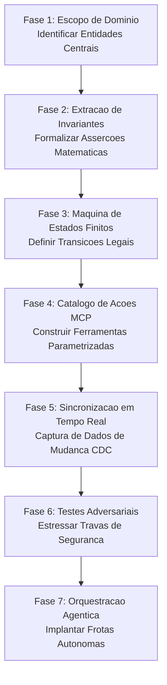
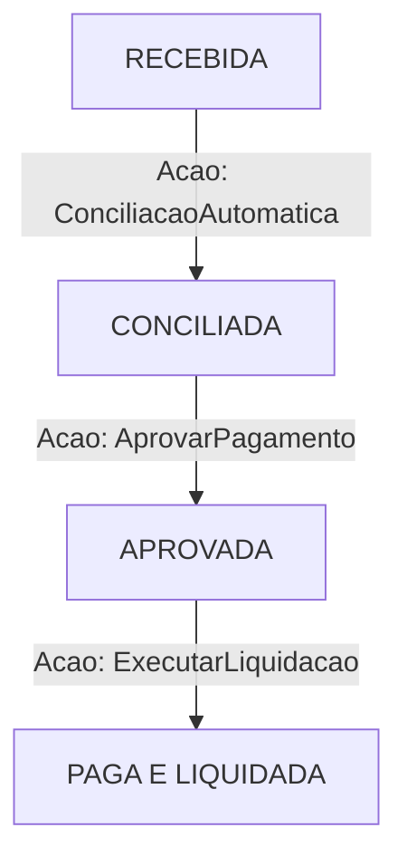
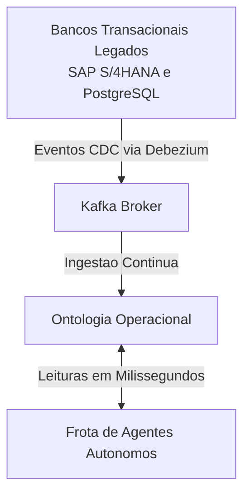
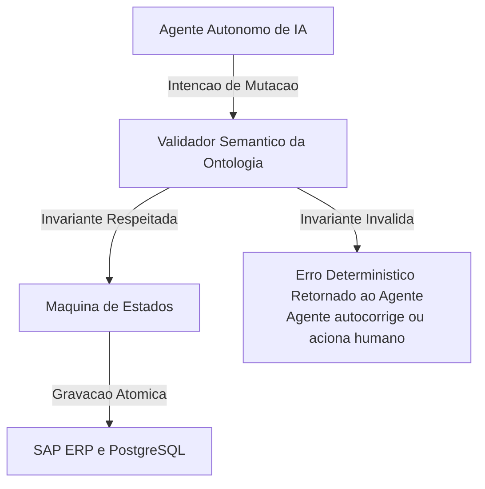

*Tempo de leitura: 8 minutos. Autor: Hugo S. Nascimento.*

<!-- more -->

*Contexto: Todo projeto de agentes na HSN Labs começa no mesmo lugar: desenhando a ontologia operacional do cliente. Sem essa fundação de dados e regras, nenhum modelo de linguagem consegue atuar de forma segura no mundo corporativo.*

A maioria das iniciativas de IA começa escolhendo qual modelo de linguagem utilizar ou configurando bancos vetoriais. Essa é a ordem inversa da boa engenharia de software.

Se os sistemas centrais da sua empresa não possuírem uma representação formal e clara do que é um cliente, um pedido, uma fatura e quais ações são permitidas em cada etapa, o melhor modelo disponível no mercado continuara alucinando e gerando erros operacionais graves.

---

## As Sete Fases do Blueprint de Engenharia

### Fase 1: Delimitação do Domínio e Mapeamento de Entidades
O primeiro passo não é escrever prompts, mas isolar de três a cinco entidades fundamentais do negócio. Em uma operação de faturamento, por exemplo: Fatura, Pedido de Compra, Fornecedor e Memorando de Crédito.

### Fase 2: Extração de Invariantes e Contratos de Dados
Entidades corporativas exigem asserções matemáticas rigorosas. Em uma ontologia operacional, entidades são estruturadas como contratos estritos onde cada atributo é amarrado por invariantes de negócio:

| Atributo do Contrato | Tipo / Formato | Regra de Validação e Invariante |
| :--- | :--- | :--- |
| `fatura_id` | Texto padrao FAT com 8 digitos numericos | Identificador padronizado auditável. |
| `fornecedor_id` | Texto minimo 3 caracteres | Deve existir e estar ativo no cadastro mestre. |
| `valor_itens` | Numérico decimal maior que zero | Soma exata de todos os itens de linha faturados. |
| `valor_impostos` | Numérico decimal maior ou igual a zero | Alíquotas validadas contra matriz fiscal. |
| `valor_total` | Numérico decimal maior que zero | **Invariante Matemática:** `valor_total == valor_itens + valor_impostos`. Divergências bloqueiam ingestão. |
| `moeda` | Enum BRL, USD ou EUR | Moeda declarada compatível com a praça contratual. |

---

### Fase 3: Máquinas de Estados Finitos
Para impedir que agentes tentem pagar faturas antes de auditoria contábil, toda entidade e atrelada a uma máquina de estados finitos:

Abaixo detalhamos a matriz formal de transição de estados:

| Estado Atual | Ações Permitidas | Próximo Estado Válido | Invariante de Execução |
| :--- | :--- | :--- | :--- |
| `RECEBIDA` | `ConciliacaoAutomatica` | `CONCILIADA` | Exige conferência fiscal e física no ERP. |
| `CONCILIADA` | `AprovarPagamento` | `APROVADA` | Exige saldo orçamentário aprovado. |
| `APROVADA` | `ExecutarLiquidacao` | `PAGA_E_LIQUIDADA` | Dispara liquidação bancária definitiva. |
| `PAGA_E_LIQUIDADA` | Nenhuma | Estado Terminal | Registro imutável; bloqueia desembolsos duplicados. |

---

### Fase 4: Catálogo de Ações via Model Context Protocol
As ações executáveis são expostas como ferramentas MCP com validação de pré-condições e checagens obrigatórias:

| Parâmetro da Ação | Tipo / Validação | Finalidade e Barreira de Segurança |
| :--- | :--- | :--- |
| `fatura_id` | Padrão `^FAT-[0-9]{8}$` | Identificador único da fatura conciliada. |
| `operador_aprovador` | Identificador auditável | Registra a assinatura criptográfica do agente ou operador humano responsável. |
| `valor_aprovado` | Numérico maior que zero | Confrontado contra o teto de autonomia financeira 10 mil dolares. Valores superiores exigem alçada de diretoria. |

---

### Fase 5: Sincronização em Tempo Real via CDC
Para manter a ontologia consistente sem sobrecarregar o banco transacional, implementamos captura de mudanças em tempo real:

---

### Fase 6: Testes Adversariais e Fuzzing de Invariantes
Antes de colocar o agente em produção, as travas da ontologia são submetidas a baterias de testes com payloads malformados e tentativas de injeção:

| Vetor de Teste Adversarial | Cenário Simulado | Comportamento Obrigatório da Ontologia |
| :--- | :--- | :--- |
| **Transição Ilegal de Estado** | Agente tenta liquidar fatura que ainda está no estado `RECEBIDA`. | **Bloqueio Imediato:** Código de violação `TRANSICAO_ESTADO_INVALIDA`; mutação abortada. |
| **Estouro de Alçada Financeira** | Agente solicita pagamento de fatura de R$ 150.000 sob pretexto de urgência executiva. | **Interceptação:** Travas determinísticas barram envio bancário e roteiam para aprovação manual. |
| **Alucinação Aritmética** | Valores de itens declarados divergem do total bruto informado pelo fornecedor. | **Rejeição no Perímetro:** Fatura recusada na porta de entrada sem abrir conexão com banco legado. |

---

### Fase 7: Orquestração e Execução Agêntica
Na camada final, os agentes operam sob a blindagem contínua da ontologia:

---

## Conclusão Técnica

Construir uma ontologia corporativa exige rigor analítico e compreensão profunda dos processos de negócio. No entanto, é o único investimento estrutural que transforma protótipos frágeis em software corporativo resiliente.

## Notas de Campo e Artigos Relacionados
- <a href="/blog/pt/post/a-ontologia-operacional/">A Ontologia Operacional: Como Empresas Conectam LLMs aos Dados Proprietarios</a>
- <a href="/blog/pt/post/como-construir-ontologia-operacional-python-mcp/">Como Construir uma Ontologia Operacional de Negocios em Python e MCP</a>
- <a href="/blog/pt/post/ontologia-vs-grafo-conhecimento/">Ontologia vs Grafo de Conhecimento: Diferencas Chave e Arquitetura</a>
- <a href="/blog/pt/post/palantir-aip-bootcamp-ontologia-operacional/">A Arquitetura do Palantir AIP: Por Que Agentes Exigem Ontologia Operacional</a>
- <a href="/blog/pt/post/isolamento-perimetro-mcp-contratos-dados/">Como Protegemos Bancos de Dados Enterprise de Agentes de IA</a>
- <a href="/blog/pt/post/sistemas-legados-motor-execucao/">Sistemas Transacionais Legados Nao Vao Morrer: Eles Sao o Motor</a>
- <a href="/blog/pt/post/sprint-arquitetura-cinco-dias/">Por Que Apresentacoes de Big 4 Falham em Projetos de Agentes</a>
- <a href="/blog/pt/post/chatbot-vs-agente/">Chatbot vs Agente: Por Que Substituir BPOs Exige Ontologias em Producao</a>
- <a href="/blog/pt/post/estudo-caso-latam-airlines/">LATAM Airlines: Agentes em Producao com Margem de 3 Por Cento</a>
- <a href="/blog/pt/post/estudo-caso-cleveland-clinic-agentes-operacionais/">Estudo de Caso: Como a Cleveland Clinic Escalou Fluxo de Pacientes</a>
- <a href="/blog/pt/post/agentes-ilimitados-maquinas-estados-finitos/">Estudo de Caso: 42 Chamadas em Loop as 2 da Manha</a>
- <a href="https://hsnlabs.ai/pt/bootcamp/">Aplicar para o Bootcamp de Agentes Enterprise de 5 Dias da HSN Labs</a>