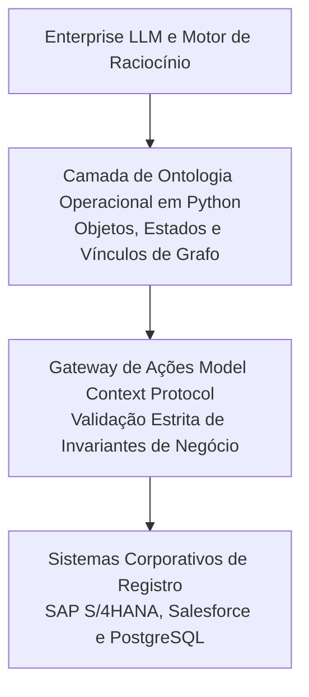

*Tempo de leitura: 6 minutos. Autor: Hugo S. Nascimento.*

<!-- more -->

*Contexto: No ecossistema de software corporativo da HSN Labs, Python é a nossa linguagem padrão de fundação. Este post ensina como transformar conceitos abstratos de ontologia em schemas estritos de Pydantic integrados a servidores MCP.*

Modelos de linguagem precisam de interfaces determinísticas para interagir com o ambiente corporativo. Quando permitimos que agentes gerem chamadas de API sem validação semântica rigorosa, erros de execução e corrupção de dados tornam-se questão de tempo.

Neste tutorial prático, exploramos a implementação de uma ontologia corporativa utilizando Python, tipagem para validação de invariantes e o protocolo MCP para servir as ferramentas ao modelo.

---

## 1. Desconstruindo a Ontologia Operacional

Em operações corporativas, dados não podem ser tratados como simples linhas tabulares. Uma ontologia operacional é composta por três camadas interligadas de software:

1. **Objetos:** Representações normalizadas de entidades reais do negócio, como Faturas, Pedidos de Compra e Contratos.
2. **Propriedades e Vínculos:** Atributos estritos e relacionamentos determinísticos conectando entidades entre si.
3. **Ações:** Mutações controladas que alteram o estado dos sistemas por meio de integrações transacionais seguras.

---

## 2. Camada 1: Definindo Objetos e Invariantes com Contratos Estritos

Em vez de enviar dicionários soltos ou textos não estruturados para o modelo, cada entidade corporativa e definida como um contrato de dados estrito.

No fluxo de resolução de disputas financeiras, o contrato da entidade impõe invariantes rigorosos de perímetro:

| Atributo do Contrato | Tipo / Restrição | Invariante e Barreira Operacional |
| :--- | :--- | :--- |
| `disputa_id` | Padrão `^DISP-[0-9]{8}$` | Identificador único auditável; bloqueia duplicidades. |
| `numero_fatura` | Texto minimo 5 caracteres | Chave estrangeira verificada contra o razão de contas a pagar. |
| `fornecedor_id` | Texto mínimo 3 caracteres | Deve corresponder a fornecedor ativo e regular no cadastro mestre. |
| `valor_reclamado` | Numérico decimal maior que zero | Precisão decimal exata; valores nulos ou negativos são rejeitados. |
| `tolerancia_contratual_pct` | Numérico entre 0,00 e 0,10 | Margem de tolerância contratual delimitada padrão de 2 por cento com teto de 10 por cento. |
| `categoria` | Enum Estrito | Restrito a `DIVERGENCIA_PRECO`, `MERCADORIA_DANIFICADA`, `ENTREGA_INCOMPLETA`. |

Ao encapsular objetos de negócio em contratos rígidos, entradas inválidas são rejeitadas na serialização antes de atingir qualquer código de execução.

---

## 3. Camada 2: Gateways de Ação via Model Context Protocol

Agentes autônomos nunca devem possuir permissão direta de escrita no banco de dados. Todas as mutações de estado precisam passar por um gateway controlado de ação.

O Model Context Protocol estabelece um padrão aberto para fornecimento de ferramentas e contexto aos modelos. Ele opera como uma porta universal, permitindo a execução de funções em infraestruturas seguras sem integrações frágeis.

Na ferramenta MCP de liquidação de disputas denominada executar_liquidacao_disputa, a execução é dividida em etapas obrigatórias de conferência:

| Etapa do Gateway | Verificação Executada | Regra de Bloqueio |
| :--- | :--- | :--- |
| **1. Validação de Entidade** | Consulta a disputa ativa no grafo transacional. | Se a disputa não existir ou já estiver encerrada, a execução é abortada. |
| **2. Invariantes Financeiros** | Confronta o valor aprovado com o montante reclamado e alçadas. | O valor de liquidação jamais pode exceder o valor em disputa; quantias acima do teto de autonomia exigem dupla aprovação humana. |
| **3. Liquidação Atômica no ERP** | Registra o memorando de crédito diretamente no SAP / ERP legado. | Gera ID transacional imutável e retorna recibo assinado para auditoria. |

Esse padrão assegura que o modelo de linguagem atue exclusivamente como planejador. A modificação de estado é blindada por invariantes de código determinístico.

---

## 4. Comparação Arquitetural: Stack Aberta vs Plataforma Proprietária

| Camada Arquitetural | Stack Aberta Python e MCP | Plataforma Fechada Foundry |
|---|---|---|
| **Contratos de Dados** | Schemas Estritos e JSON Schema | Construtor Proprietário de Objetos |
| **Execução de Ferramentas** | Model Context Protocol Padrão Aberto | Ações Proprietárias e Funções AIP |
| **Orquestração de Estado** | Máquinas de Estado e Orquestradores Abertos | Ferramentas Proprietárias de Automação |
| **Armazenamento e Grafo** | PostgreSQL, pgvector e Bancos Grafos | Monólito Proprietário |
| **Custo de Licenciamento** | Zero Custo de Licença Base | Contratos Corporativos Milionários |
| **Infraestrutura** | Roda dentro da VPC do Cliente | Nuvem Dedicada do Fornecedor |

---

## 5. Conclusão para Produção

Inteligência artificial corporativa não e um problema de engenharia de prompt. É um problema clássico de engenharia de sistemas distribuídos.

Ao substituir prompts vagos por contratos fortemente tipados e rotear comandos através de gateways MCP, líderes de tecnologia alcançam precisão operacional sem dependência de contratos fechados.

## Recursos Estrategicos e Posts Relacionados
- <a href="/blog/pt/post/como-construir-ontologia-enterprise-do-zero/">Como Construir uma Ontologia Enterprise do Zero: Passo a Passo</a>
- <a href="/blog/pt/post/ontologia-vs-grafo-conhecimento/">Ontologia vs Grafo de Conhecimento: Diferencas Chave e Arquitetura</a>
- <a href="/blog/pt/post/palantir-aip-bootcamp-ontologia-operacional/">A Arquitetura do Palantir AIP: Por Que Agentes Exigem Ontologia Operacional</a>
- <a href="https://hsnlabs.ai/pt/bootcamp/">Aplicar para o Bootcamp de Agentes Enterprise de 5 Dias da HSN Labs</a>