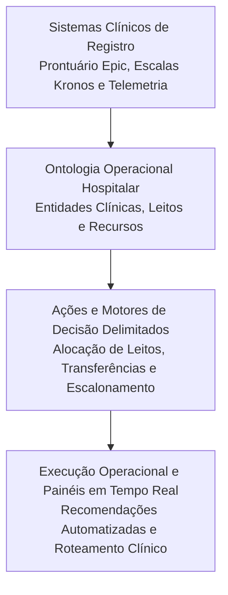

*Tempo de leitura: 5 minutos. Autor: Hugo S. Nascimento.*

<!-- more -->

*Contexto: Operações hospitalares são o ambiente mais complexo e unforgiving para software de automação. Um erro de atribuição de leito ou alocação de equipe afeta vidas humanas. Este estudo disseca a infraestrutura necessária para orquestrar dados críticos em escala massiva.*

A Cleveland Clinic gerencia mais de seis mil e seiscentos leitos hospitalares espalhados por dezenas de unidades. O desafio diário de coordenar admissões de emergência, altas médicas, preparação de leitos e alocação de equipes de enfermagem gerava atrasos históricos e sobrecarga operacional.

Abordagens tradicionais de painéis de controle e dashboards analíticos apenas exibiam o problema. Não tomavam nenhuma ação no mundo real.

## A Solução com Ontologia Operacional de Saúde

Para resolver o gargalo, a instituição não tentou colocar um modelo de linguagem generativo conversando com os médicos. Em vez disso, foi desenhada uma ontologia operacional integrando três domínios centrais:

### 1. Entidades Clínicas e de Infraestrutura
O sistema mapeia digitalmente cada leito, aparelho respiratório, leito de UTI, equipe de plantão e paciente como nos conectados com atributos em tempo real. Uma mudança no prontuário eletrônico atualiza imediatamente as restrições operacionais daquele leito.

### 2. Ações de Despacho em Malha Fechada
Quando uma alta médica e confirmada no prontuário, o agente dispara automaticamente as ordens de serviço para a equipe de higienização e sinaliza para a triagem da emergência a disponibilidade estimada daquele leito. 

### 3. Resolução Proativa de Conflitos
Se dois pacientes de alta prioridade necessitarem do mesmo tipo de equipamento especializado, o sistema avalia as variáveis clínicas parametrizadas pelo corpo médico e propõe a redistribuição otimizada de recursos entre andares antes que uma crise se instale.

## Lições para Líderes de Tecnologia

A experiência da Cleveland Clinic reforça os princípios centrais defendidos pela HSN Labs em contratos corporativos:

- Dashboards passivos estão obsoletos em ambientes de alta velocidade
- Agentes autônomos precisam de ontologias de domínio estritas para agir com precisão
- Integração profunda com sistemas de registro é o único caminho para criar valor mensurável

## Recursos Estrategicos e Posts Relacionados
- <a href="/blog/pt/post/como-construir-ontologia-enterprise-do-zero/">Como Construir uma Ontologia Enterprise do Zero: Passo a Passo</a>
- <a href="/blog/pt/post/agentes-ilimitados-maquinas-estados-finitos/">Estudo de Caso: 42 Chamadas em Loop as 2 da Manha</a>
- <a href="/blog/pt/post/a-ontologia-operacional/">A Ontologia Operacional: Como Empresas Conectam LLMs aos Dados Proprietarios</a>
- <a href="https://hsnlabs.ai/pt/bootcamp/">Aplicar para o Bootcamp de Agentes Enterprise de 5 Dias da HSN Labs</a>