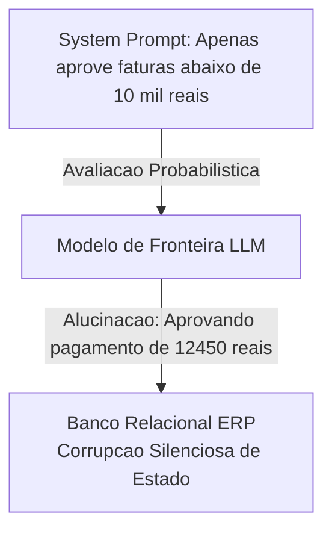
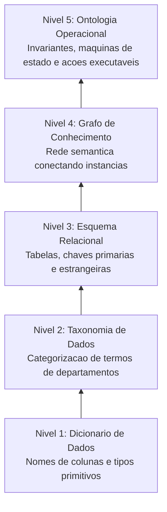
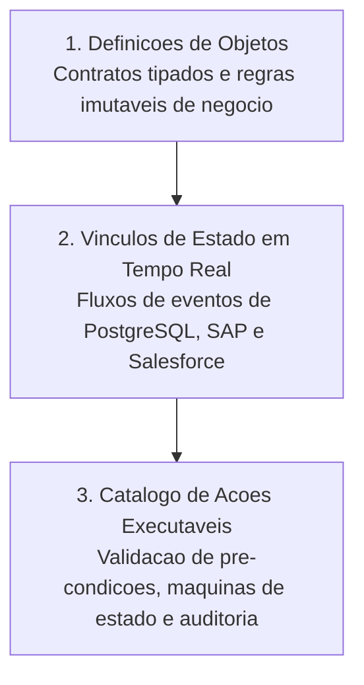
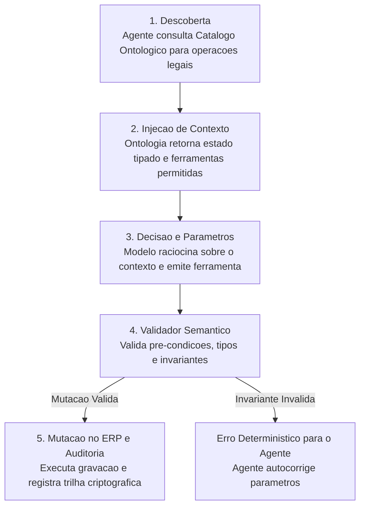

*Tempo de leitura: 8 minutos. Autor: Hugo S. Nascimento.*

<!-- more -->

*Contexto: Escrevi este guia para unificar os conceitos que apresento diariamente em workshops executivos e nas esteiras de engenharia da HSN Labs. Se você precisa entender ontologias para agentes de forma prática e definitiva, este é o ponto de partida.*

O entusiasmo em torno de agentes autônomos gerou uma avalanche de demonstrações impressionantes nas redes sociais. No entanto, quando líderes técnicos tentam implantar esses mesmos agentes no ambiente corporativo real, a taxa de sucesso cai drasticamente.

A razão e simples: agentes probabilísticos não compreendem o contexto operacional da sua empresa a menos que você forneça uma estrutura formal de domínio. Essa estrutura é o que chamamos de Ontologia.

Modelos de linguagem computam distribuições estatísticas de probabilidade. Quando empresas tentam conter o comportamento desses modelos apenas com prompts de sistema em texto corrido, constroem sobre alicerces frágeis:



---

## A Escada Semântica: Onde a Ontologia se Posiciona

Para compreender a necessidade de uma ontologia, e preciso visualizar a hierarquia da representação do conhecimento corporativo:



---

## Os Três Componentes de uma Ontologia para Agentes

Uma ontologia operacional é composta por três camadas essenciais:



---

## Contrato de Validação em Tempo de Execução

Abaixo exemplificamos como a ontologia governa a validação de liquidação financeira através de um contrato estrito:

```json
{
  "title": "AprovacaoFaturaCorporativa",
  "type": "object",
  "properties": {
    "fatura_id": {
      "type": "string",
      "pattern": "^FAT-[0-9]{8}$"
    },
    "fornecedor_id": {
      "type": "string",
      "minLength": 3
    },
    "valor_total": {
      "type": "number",
      "minimum": 0.01
    },
    "limite_alcada": {
      "type": "number",
      "default": 10000.00
    },
    "operador_aprovador": {
      "type": "string"
    }
  },
  "required": [
    "fatura_id",
    "fornecedor_id",
    "valor_total",
    "operador_aprovador"
  ]
}
```

---

## O Ciclo de Execução em Produção

Em vez de enviar documentações infinitas de banco de dados, o agente interage com o ecossistema através de um loop fechado e determinístico:



---

## O Conceito em Linguagem Simples

Imagine contratar um analista brilhante, mas que nunca teve contato com os sistemas internos da sua companhia. Se você pedir para ele resolver uma ocorrência sem explicar o que significa cada código de status ou quais limites de alçada ele possui, ele tomara decisões equivocadas.

A ontologia funciona como o sistema nervoso digital da empresa. Ela explica ao agente:

- Quem são as entidades do negócio e como se relacionam
- Quais dados são confiáveis e quais são históricos legados
- Quais operações podem ser executadas autonomamente e quais exigem autorização humana

## A Diferença entre RAG Simples e Ontologia Operacional

Muitas empresas tentam resolver a falta de contexto aplicando Retrieval-Augmented Generation genérico sobre manuais em PDF. Essa técnica é suficiente para responder perguntas de clientes, mas completamente incapaz de executar operações transacionais.

Enquanto o RAG recupera fragmentos de texto desestruturados com base em similaridade semântica, a ontologia operacional fornece esquemas tipados, relações formais e ferramentas executáveis com garantias estritas de integridade.

## Como Começar na Sua Organização

1. Escolha um processo de negócio delimitado com alto volume operacional e regras claras
2. Mapeie as entidades centrais e as restrições inegociáveis do processo
3. Codifique os modelos de dados em Python utilizando bibliotecas rigorosas de validação
4. Exponha as ferramentas para os agentes utilizando o padrão aberto Model Context Protocol
5. Teste o comportamento do agente contra transações históricas antes de liberar gravações em produção

Construir ontologias é o investimento definitivo que separa empresas que apenas experimentam com IA daquelas que extraem valor econômico real e sustentável de seus sistemas autônomos.

## Notas de Campo e Artigos Relacionados
- <a href="/blog/pt/post/cemiterio-de-pocs/">Por Que Agentes Falham: O Cemiterio de PoCs</a>
- <a href="/blog/pt/post/por-que-rag-falha-em-erp/">Por Que RAG Tradicional Falha em ERPs Financeiros</a>
- <a href="/blog/pt/post/deriva-de-integracao/">A Deriva de Integracao: Quando Prompts Quebram Agentes em Producao</a>
- <a href="/blog/pt/post/falacia-llm-como-juiz/">Por Que LLM Como Juiz Falha no Setor Bancario</a>
- <a href="/blog/pt/post/ontologia-vs-schema-banco-dados/">Ontologia vs Schema de Banco de Dados: Por Que Tabelas Relacionais Quebram Agentes</a>
- <a href="/blog/pt/post/palantir-vs-databricks-arquitetura-agentes/">Palantir vs Databricks: Por Que Data Lakes Falham na Orquestracao de Agentes</a>
- <a href="https://hsnlabs.ai/pt/bootcamp/">Aplicar para o Bootcamp de Agentes Enterprise de 5 Dias da HSN Labs</a>