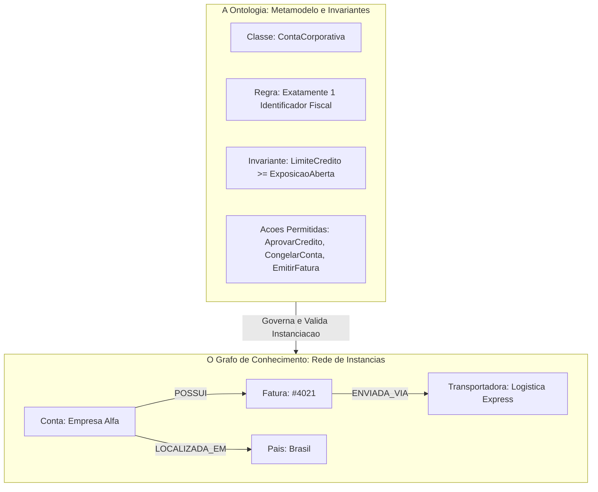
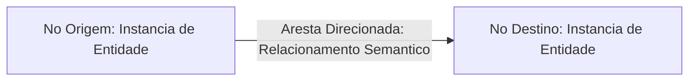
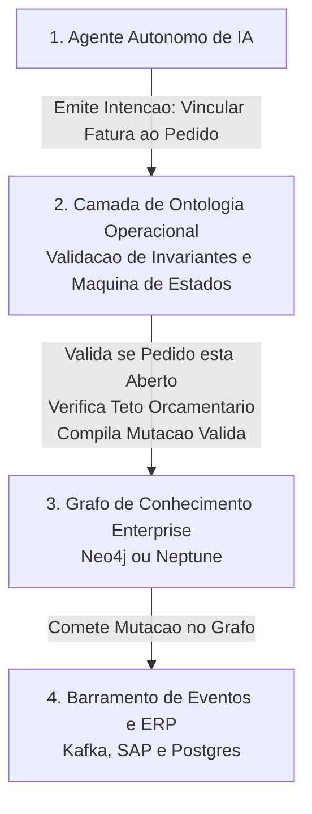

*Tempo de leitura: 6 minutos. Autor: Hugo S. Nascimento.*

<!-- more -->

*Contexto: No mercado de tecnologia corporativa, os termos ontologia e grafo de conhecimento são usados de forma intercambiável por fornecedores de software. Essa confusão conceitual leva a escolhas arquiteturais equivocadas.*

Embora ambos compartilhem fundamentos de teoria de grafos e representação de informações, ontologias e grafos de conhecimento desempenham papeis profundamente distintos em uma arquitetura de software para agentes.

Compreender a fronteira exata entre esses dois conceitos é o primeiro passo para desenhar sistemas escaláveis e seguros.

---

## Definições Formais e Comparação Visual

- Uma **Ontologia** e o **esquema, lógica e sistema de regras**. Ela define os tipos abstratos, relacionamentos válidos, invariantes matemáticas e transições de estado permitidas no seu negócio. E a definição do tipo em código.
- Um **Grafo de Conhecimento** e a **rede de instâncias e fatos concretos**. Ele instancia esses tipos abstratos com registros corporativos reais e os conecta através de arestas direcionadas. E o objeto vivo na memória.



---

## Estrutura do Grafo: Nós, Arestas e Propriedades

Um grafo de conhecimento organiza a informação empresarial através de três elementos fundamentais:



1. **Nós:** Instâncias de entidades discretas, como Cliente, Produto ou Unidade Fabril.
2. **Arestas Direcionadas:** Conexões semânticas explícitas ligando dois nós com direcionalidade.
3. **Propriedades:** Metadados concretos armazenados em nós e arestas.

---

## Arquitetura de Dupla Camada: Acoplando o Grafo à Ontologia

Em produção corporativa, a ontologia atua como compilador e governança diretamente acima do grafo de conhecimento. Toda criação de nó, travessia de aresta e mutação de estado tentada pelo agente precisa passar pela esteira de validação da ontologia antes de atingir o banco de dados do grafo.



---

## Contrato de Mutação de Grafo

Abaixo apresentamos a especificação de ferramenta via contrato estrito que governa a escrita no grafo corporativo:

```json
{
  "name": "vincular_fatura_pedido_compra",
  "description": "Vincula fatura validada ao respectivo pedido de compras no grafo corporativo",
  "parameters": {
    "type": "object",
    "properties": {
      "fatura_id": {
        "type": "string",
        "pattern": "^FAT-[0-9]{6}$"
      },
      "pedido_compra_id": {
        "type": "string",
        "pattern": "^PED-[0-9]{6}$"
      },
      "valor_total": {
        "type": "number",
        "minimum": 0.01
      },
      "operador_aprovador": {
        "type": "string"
      }
    },
    "required": [
      "fatura_id",
      "pedido_compra_id",
      "valor_total"
    ]
  }
}
```

---

## Como os Dois Componentes Trabalham Juntos

Em uma arquitetura moderna da HSN Labs, esses componentes operam em simbiose perfeita:

- A Ontologia estabelece as definições e as travas de segurança
- O Grafo de Conhecimento materializa o estado atual das operações da companhia
- Os Agentes de Software consultam o grafo sob a supervisão estrita da ontologia para executar tarefas no mundo real

Sem ontologia, um grafo de conhecimento torna-se um emaranhado de dados sem governanca. Sem grafo de conhecimento, a ontologia e apenas um esquema teórico sem utilidade prática.

## Recursos Estratégicos e Posts Relacionados

- <a href="/blog/pt/post/como-construir-ontologia-enterprise-do-zero/">Como Construir uma Ontologia Enterprise do Zero: Passo a Passo</a>
- <a href="/blog/pt/post/a-ontologia-operacional/">A Ontologia Operacional: Como Empresas Conectam LLMs aos Dados Proprietários</a>
- <a href="/blog/pt/post/palantir-aip-bootcamp-ontologia-operacional/">A Arquitetura do Palantir AIP: Por Que Agentes Exigem Ontologia Operacional</a>
- <a href="https://hsnlabs.ai/pt/bootcamp/">Aplicar para o Bootcamp de Agentes Enterprise de 5 Dias da HSN Labs</a>