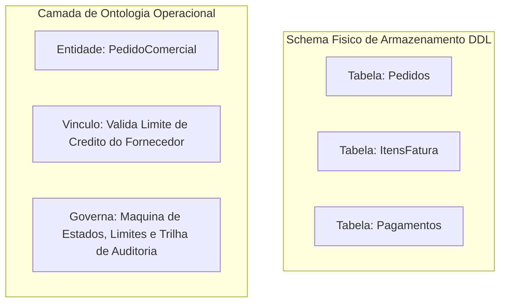
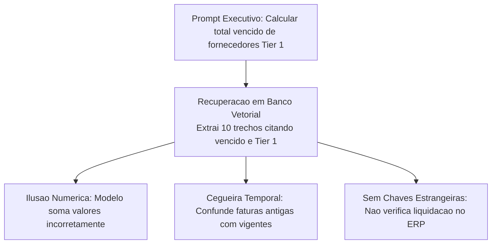
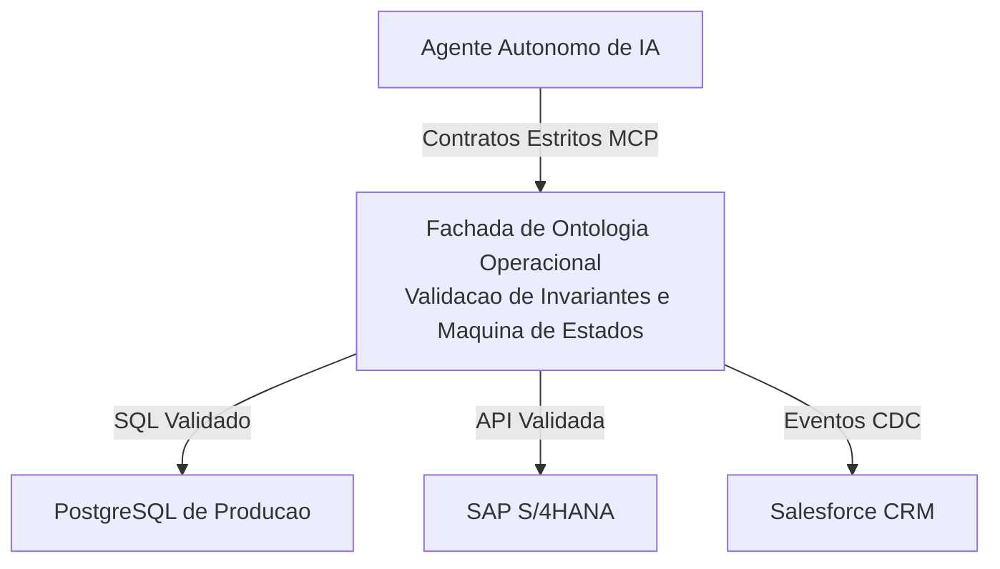

*Tempo de leitura: 8 minutos. Autor: Hugo S. Nascimento.*

<!-- more -->

*Contexto: Em consultorias com equipes de engenharia de dados, frequentemente escuto a pergunta: se nos já temos tabelas relacionais no PostgreSQL e um banco vetorial no Pinecone, por que precisamos de uma ontologia? Aqui está a resposta técnica definitiva.*

Bancos de dados relacionais foram desenhados para persistência eficiente e garantia de propriedades ACID em transações computacionais. Bancos vetoriais foram desenvolvidos para busca por similaridade semântica em textos não estruturados.

Nenhum dos dois foi concebido para fornecer a agentes de software o entendimento de intenção, semântica de negócio e limites de ação no mundo corporativo.



---

## O Problema dos Schemas Legados Crípticos

Sistemas corporativos rodam sobre plataformas legadas como SAP ECC, SAP S/4HANA ou Totvs Protheus. Essas bases possuem colunas indecifráveis para um modelo de linguagem sem contexto operacional formal:

```yaml
tabela_sap_bseg:
  mandt: VARCHAR_3
  bukrs: VARCHAR_4
  belnr: VARCHAR_10
  gjahr: NUMERIC_4
  buzei: NUMERIC_3
  shkzg: VARCHAR_1
  dmbtr: NUMERIC_13_2
  koart: VARCHAR_1
```

Um agente probabilístico inspecionando essa tabela não sabe o significado dessas siglas na legislação fiscal. Enviar dicionários gigantescos de dados esgota a janela de contexto e eleva as taxas de alucinação.

---

## Ausência de Invariantes de Negócio nos Schemas Relacionais

Schemas de banco impõem restrições técnicas, mas são cegos para regras dinâmicas de fluxo comercial:

```yaml
tabela_ordens:
  ordem_id: UUID_CHAVE_PRIMARIA
  cliente_id: UUID_REFERENCIA
  status: TEXT
  valor_total: NUMERIC
```

Para o PostgreSQL, alterar o status de pendente diretamente para reembolsado sem passar por pago ou faturado é uma operação totalmente válida. O banco aceita a gravação e a contabilidade e corrompida.

---

## Risco de Negação de Serviço por Consultas Ilimitadas

Conceder acesso SQL direto para um agente de IA e uma vulnerabilidade operacional grave. O modelo pode gerar consultas desindexadas cruzando milhões de registros:

```sql
SELECT c.cliente_nome, o.valor_total
FROM clientes c
JOIN pedidos o ON c.cliente_id = o.cliente_id
WHERE o.status = 'PENDENTE'
```

Consultas desse tipo esgotam buffers de memória e travam a base de dados central em horário de pico.

---

## Por Que Bancos Vetoriais Não Salvam a Operação

Bancos vetoriais são adequados para recuperar textos conceituais em manuais técnicos, mas totalmente incapazes de sustentar operações estruturadas:



---

## Comparação Estrutural entre Tecnologias

| Característica | Schema Relacional SQL | Banco de Dados Vetorial | Ontologia Operacional |
| :--- | :--- | :--- | :--- |
| Propósito Central | Armazenamento e persistência | Recuperação por similaridade | Ação autônoma e semântica |
| Representação | Tabelas, linhas e colunas | Embeddings em alta dimensão | Entidades, relações e ações |
| Compreensão de Regras | Chaves e restrições simples | Zero compreensão de regras | Invariantes de negócio formais |
| Capacidade de Ação | Requer queries manuais | Nenhuma capacidade de ação | Ferramentas executáveis com travas |
| Comportamento de IA | Alucinações frequentes de join | Respostas baseadas em proximidade | Execução determinística segura |

---

## Comparação de Código: Falha do DDL vs Triunfo da Ontologia

Considere a seguinte regra corporativa: uma empresa não pode emitir abatimento financeiro se o cliente estiver em disputa jurídica ou se o valor ultrapassar quinze por cento do pedido original.

### Abordagem Frágil via Tabela Relacional

```yaml
tabela_memorando_credito:
  memorando_id: UUID_CHAVE_PRIMARIA
  ordem_id: UUID_REFERENCIA
  cliente_id: UUID_REFERENCIA
  valor: NUMERIC
  data_criacao: TIMESTAMP
```

O banco relacional aceita qualquer valor numérico inserido pelo agente, permitindo desvios financeiros irreversíveis.

### Abordagem Robusta via Ontologia Operacional

Na ontologia operacional, o agente nunca recebe permissão direta de inserção no banco. Ele invoca uma ação com contrato estrito:

```json
{
  "name": "emitir_memorando_credito",
  "description": "Executa compensacao de credito vinculada a pedido comercial",
  "parameters": {
    "type": "object",
    "properties": {
      "pedido_id": {
        "type": "string"
      },
      "cliente_id": {
        "type": "string"
      },
      "valor_pedido_original": {
        "type": "number",
        "minimum": 0.01
      },
      "valor_credito_solicitado": {
        "type": "number",
        "minimum": 0.01
      },
      "status_juridico": {
        "type": "string",
        "enum": ["REGULAR", "DISPUTA_JUDICIAL"]
      }
    },
    "required": [
      "pedido_id",
      "cliente_id",
      "valor_pedido_original",
      "valor_credito_solicitado",
      "status_juridico"
    ]
  }
}
```

---

## O Padrão de Fachada Ontológica

A ontologia deve se posicionar como fachada obrigatória de acesso aos sistemas de registro:



---

## Recursos Estratégicos e Posts Relacionados

- <a href="/blog/pt/post/o-que-e-uma-ontologia-para-agentes-ia/">O Que É uma Ontologia para Agentes de IA? O Guia Definitivo</a>
- <a href="/blog/pt/post/por-que-rag-falha-em-erp/">Por Que RAG Tradicional Falha em ERPs Financeiros</a>
- <a href="/blog/pt/post/palantir-vs-databricks-arquitetura-agentes/">Palantir vs Databricks: Por Que Data Lakes Falham na Orquestração de Agentes</a>
- <a href="https://hsnlabs.ai/pt/bootcamp/">Aplicar para o Bootcamp de Agentes Enterprise de 5 Dias da HSN Labs</a>
