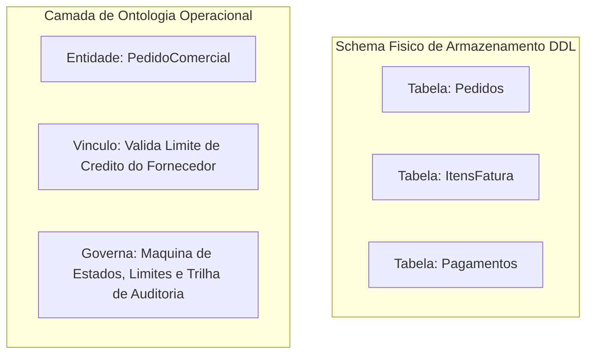
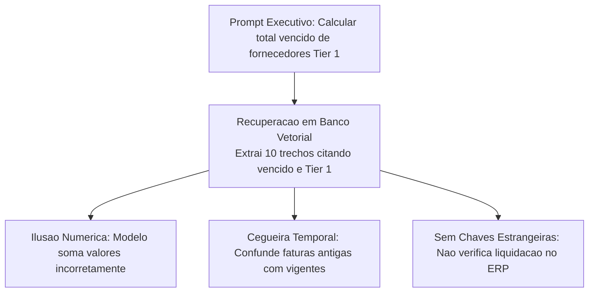
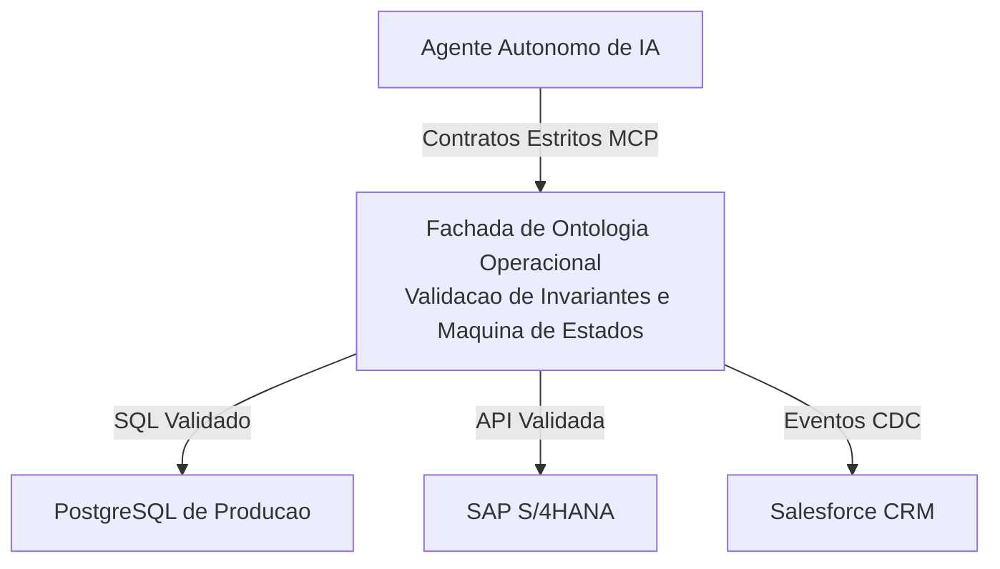

*Tempo de leitura: 8 minutos. Autor: Hugo S. Nascimento.*

<!-- more -->

*Contexto: Em consultorias com equipes de engenharia de dados, frequentemente escuto a pergunta: se nos já temos tabelas relacionais no PostgreSQL e um banco vetorial no Pinecone, por que precisamos de uma ontologia? Aqui está a resposta técnica definitiva.*

Bancos de dados relacionais foram desenhados para persistência eficiente e garantia de propriedades ACID em transações computacionais. Bancos vetoriais foram desenvolvidos para busca por similaridade semântica em textos não estruturados.

Nenhum dos dois foi concebido para fornecer a agentes de software o entendimento de intenção, semântica de negócio e limites de ação no mundo corporativo.

---

## O Problema dos Schemas Legados Crípticos

Sistemas corporativos rodam sobre plataformas legadas como SAP ECC, SAP S/4HANA ou Totvs Protheus. Essas bases possuem colunas indecifráveis para um modelo de linguagem sem contexto operacional formal. Na tabela `BSEG` do SAP, Segmento de Documento Contabil, os campos são siglas opacas:

| Coluna Legada SAP | Tipo de Dado | Significado de Negócio |
| :--- | :--- | :--- |
| `MANDT` | `VARCHAR 3` | Mandante / Identificador da empresa |
| `BUKRS` | `VARCHAR 4` | Código da empresa |
| `BELNR` | `VARCHAR 10` | Número do documento contábil |
| `GJAHR` | `NUMERIC 4` | Exercício fiscal / Ano |
| `BUZEI` | `NUMERIC 3` | Linha do item no lançamento |
| `SHKZG` | `VARCHAR 1` | Indicador de Débito/Crédito S para debito e H para credito |
| `DMBTR` | `NUMERIC 13 2` | Montante em moeda local |
| `KOART` | `VARCHAR 1` | Tipo de conta D para Cliente, K para Fornecedor, S para Razao |

Um agente probabilístico inspecionando essa tabela não sabe o significado dessas siglas na legislação fiscal. Enviar dicionários gigantescos de dados esgota a janela de contexto e eleva as taxas de alucinação.

---

## Ausência de Invariantes de Negócio nos Schemas Relacionais

Schemas de banco impõem restrições técnicas , a exemplo de tipos primitivos e chaves estrangeiras,, mas são cegos para regras dinâmicas de fluxo comercial.

Por exemplo, em uma tabela de pedidos armazenando `ordem_id`, `cliente_id`, `status` e `valor_total`, para o banco relacional alterar o status de `PENDENTE` diretamente para `REEMBOLSADO` sem passar por `PAGO` ou `FATURADO` é uma operação perfeitamente válida. O banco aceita a gravação e a contabilidade corporativa é corrompida.

---

## Risco de Negação de Serviço por Consultas Ilimitadas

Conceder acesso SQL direto para um agente de IA e uma vulnerabilidade operacional grave. O modelo pode gerar consultas desindexadas cruzando milhões de registros—por exemplo, varrendo todo o histórico de pedidos com filtros de texto aberto filtrando por status pendente sem índices adequados.

Consultas desse tipo esgotam buffers de memória e travam a base de dados central em horário de pico.

---

## Por Que Bancos Vetoriais Não Salvam a Operação

Bancos vetoriais são adequados para recuperar textos conceituais em manuais técnicos, mas totalmente incapazes de sustentar operações estruturadas:

---

## Comparação Estrutural entre Tecnologias

| Característica | Schema Relacional SQL | Banco de Dados Vetorial | Ontologia Operacional |
| :--- | :--- | :--- | :--- |
| Propósito Central | Armazenamento e persistência | Recuperação por similaridade | Ação autônoma e semântica |
| Representação | Tabelas, linhas e colunas | Embeddings em alta dimensão | Entidades, relações e ações |
| Compreensão de Regras | Chaves e restrições simples | Zero compreensão de regras | Invariantes de negócio formais |
| Capacidade de Ação | Requer queries manuais | Nenhuma capacidade de ação | Ferramentas executáveis com travas |
| Comportamento de IA | Alucinações frequentes de join | Respostas baseadas em proximidade | Execução determinística segura |

---

## Comparação Arquitetural: Falha do DDL Relacional vs Blindagem da Ontologia

Considere a seguinte regra corporativa: *uma empresa não pode emitir abatimento financeiro se o cliente estiver em disputa jurídica ou se o valor ultrapassar quinze por cento do pedido original.*

### Abordagem Frágil via Tabela Relacional

Em um banco de dados relacional comum, a tabela de memorando de crédito armazena `memorando_id`, `ordem_id`, `cliente_id`, `valor` e `data_criacao`.

Se o agente autônomo gerar um comando de inserção direta liberando R$ 45.000 para uma conta com pendência jurídica:
- O banco aceita a gravação porque os tipos são válidos com UUIDs validos e valor numerico aceito.
- A empresa sofre o prejuízo porque o banco não tem capacidade de avaliar o status judicial do cliente nem de calcular limites percentuais cruzados.

### Abordagem Robusta via Ontologia Operacional

Na ontologia operacional, o agente nunca recebe permissão direta de inserção no banco. Ele invoca uma ação com contrato estrito denominada emitir_memorando_credito:

| Parâmetro da Ação | Tipo e Restrição | Invariante de Segurança Avaliado |
| :--- | :--- | :--- |
| `pedido_id` | Texto / UUID | Deve mapear para pedido comercial válido e faturado. |
| `cliente_id` | Texto / UUID | Vinculado ao cadastro mestre de compliance do cliente. |
| `valor_pedido_original` | Numérico decimal maior que zero | Valor extraído do pedido original liquidado. |
| `valor_credito_solicitado` | Numérico decimal maior que zero | **Invariante de Teto:** Não pode ultrapassar 15% do valor original. Valores superiores são abortados na hora. |
| `status_juridico` | Enum REGULAR ou DISPUTA_JUDICIAL | **Bloqueio Legal Estatutário:** Se estiver em `DISPUTA_JUDICIAL`, qualquer concessão financeira e sumariamente bloqueada. |

---

## O Padrão de Fachada Ontológica

A ontologia deve se posicionar como fachada obrigatória de acesso aos sistemas de registro:

---

## Recursos Estrategicos e Posts Relacionados
- <a href="/blog/pt/post/o-que-e-uma-ontologia-para-agentes-ia/">O Que E uma Ontologia para Agentes de IA? O Guia Definitivo</a>
- <a href="/blog/pt/post/palantir-vs-databricks-arquitetura-agentes/">Palantir vs Databricks: Por Que Data Lakes Falham na Orquestracao de Agentes</a>
- <a href="/blog/pt/post/cemiterio-de-pocs/">Por Que Agentes Falham: O Cemiterio de PoCs</a>
- <a href="https://hsnlabs.ai/pt/bootcamp/">Aplicar para o Bootcamp de Agentes Enterprise de 5 Dias da HSN Labs</a>