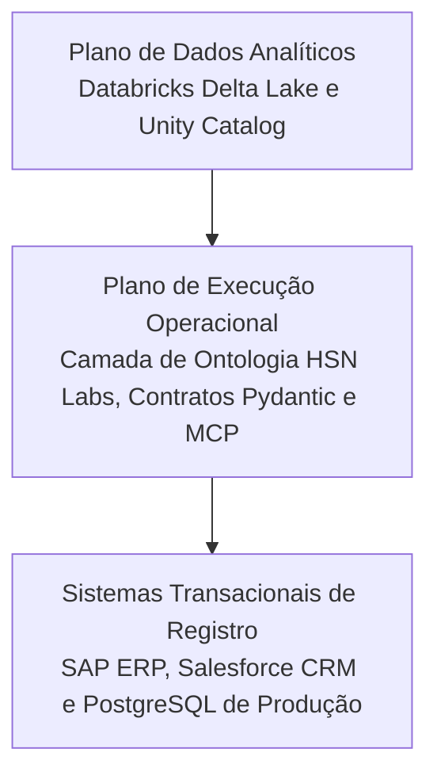

*Tempo de leitura: 6 minutos. Autor: Hugo S. Nascimento.*

<!-- more -->

*Contexto: No mercado de dados, a Databricks domina o armazenamento e treinamento analítico em escala. Mas quando corporações tentam usar Lakehouses para alimentar agentes que executam ações no mundo real, o modelo entra em colapso. Discutimos aqui o porque.*

A Databricks construiu um império excepcional baseado no conceito de Lakehouse, processamento distribuído com Spark e armazenamento eficiente em Delta Lake. Para treinamento de modelos, dashboards de BI e pipelines analíticos, e uma ferramenta de liderança global indiscutível.

O problema começa quando executivos de tecnologia acreditam que um Lakehouse é suficiente para governar agentes de IA em operações do dia a dia.

## A Diferença entre Análise Passiva e Ação Autônoma

Análise de dados e operação agêntica possuem requisitos técnicos diametralmente opostos:

### 1. Latência e Tempo de Resposta
Data lakes são otimizados para throughput em lote sobre terabytes de dados. Um agente corporativo operando em um canal de faturamento precisa de leituras atômicas em milissegundos e atualizações instantâneas de estado.

### 2. Semântica de Negócio vs Schemas Tabulares
O Delta Lake armazena tabelas e partições. Ele não sabe o que é uma violação de compliance de compras ou se um desconto concedido infrínge uma diretriz de diretoria. A Palantir venceu esse jogo porque construiu uma ontologia operacional acima dos dados.

### 3. A Capacidade de Fechar o Ciclo
Um data lake é somente leitura para quem consome análises. Um agente autônomo precisa ler o estado atual, calcular a decisão ideal e gravar o resultado no banco legado. Sem uma camada ontológica com permissões e rollback transacional, permitir que agentes escrevam no ambiente corporativo é um risco inaceitável.

## A Arquitetura Recomendada pela HSN Labs

Não propomos substituir o seu lakehouse existente. Propomos posicionar uma camada ontológica operacional entre o seu ecossistema de dados e os seus agentes de software.

O data lake continua cuidando do histórico e análise profunda, enquanto a ontologia operacional governa a ação em tempo real com segurança irrevogável.

## Recursos Estrategicos e Posts Relacionados
- <a href="/blog/pt/post/o-que-e-uma-ontologia-para-agentes-ia/">O Que E uma Ontologia para Agentes de IA? O Guia Definitivo</a>
- <a href="/blog/pt/post/cemiterio-de-pocs/">Por Que Agentes Falham: O Cemiterio de PoCs</a>
- <a href="/blog/pt/post/por-que-rag-falha-em-erp/">Por Que RAG Tradicional Falha em ERPs Financeiros</a>
- <a href="https://hsnlabs.ai/pt/bootcamp/">Aplicar para o Bootcamp de Agentes Enterprise de 5 Dias da HSN Labs</a>