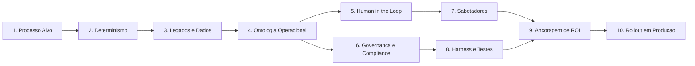

*Tempo de leitura: 5 minutos. Autor: Hugo S. Nascimento.*

<!-- more -->

A maioria dos pilotos de IA em grandes empresas morre antes do deploy. Nao por culpa do modelo de linguagem, mas por ausencia de especificacao de engenharia.

Constroem demonstracoes plasticas sobre system prompts frageis. Quando o agente entra em contato com bancos de dados relacionais legados, regras fiscais sem tolerancia a falhas e politicas internas nao documentadas, a operacao trava.

Para resolver esse gargalo metodologico antes de escrever uma unica linha de codigo, criei e disponibilizei sob licenca aberta MIT The Agentic Pilot Canvas.

A versao 1.4, atualizada em outubro de 2026, consolida os aprendizados dos nossos sprints de arquitetura na HSN Labs. O modelo e interativo e roda diretamente no navegador:

👉 **Acesse a ferramenta interativa:** [hsnlabs.ai/canvas](https://hsnlabs.ai/pt/canvas/)

---

---

## A Cadeia de Dependencias Logicas

Um piloto nao comeca na escolha do LLM. Ele segue uma esteira deterministica de dez etapas encadeadas:

---

## Os 10 Blocos do Framework

### 1. Processo Alvo e Impacto
Qual trabalho manual repetitivo consome o tempo da equipe no fluxo atual e qual o resultado ideal quando concluido?
O foco deve permanecer estritamente em gargalos operacionais internos. Nunca exponha clientes finais a testes iniciais de agentes.

### 2. Impacto Nao Deterministico
Esse processo realmente exige a flexibilidade de um agente probabilistico ou o risco nao tolera margem de incerteza?
Calculos fiscais e folha exigem codigo puro. Interpretar e-mails caoticos e conciliar dados desestruturados exige IA. O raio de destruicao financeiro e emocional precisa ser mapeado no D1.

### 3. Legados, Conexao e Dados
Onde as informacoes moram hoje — SAP, TOTVS, Salesforce, planilhas mestras ou PDFs?
Em vez de reescrever sistemas antigos, usamos engenharia reversa via agentes para transformar regras legadas em codigo tipado.

### 4. A Ontologia Operacional
Quais sao os objetos do mundo real — Colaborador, Fatura, Pedido, Fornecedor — e quais as unicas acoes tipadas que o agente pode acionar?
O modelo nunca executa SQL livre nem toca o banco bruto. Ele interage apenas com a Ontologia. Se a acao nao existe no contrato de dados, ela e matematicamente inexequivel.

### 5. Human in the Loop
Em quais limiares de valor, risco ou incerteza o agente e proibido de agir sozinho e deve pedir aprovacao?
A maquina processa e tria, mas o gestor assina a decisao formal no CPF via card interativo no Teams ou Slack.

### 6. Governanca e Compliance
Quais dados confidenciais nao podem vazar e como auditar o historico?
Mascara automatica de dados sensiveis antes da inferencia e tracing imutavel de cada raciocinio e chamada de ferramenta.

### 7. Sabotadores e Alinhamento Politico
Quem na organizacao pode temer perda de espaco, equipe ou controle com a automacao?
O agente deve ser posicionado como estagiario digital que absorve a carga burocratica, liberando analistas seniores para supervisao estrategica.

### 8. Harness e Testes Continuos
Quais ferramentas de execucao isolada, memoria de contexto e baterias de avaliacao garantem a estabilidade do sistema?
Baterias automatizadas com centenas de casos reais desafiadores rodadas a cada atualizacao de prompt ou modelo.

### 9. Ancoragem de Valor e ROI
Qual e a economia liquida comprovada na DRE corporativa descontando os custos de tokens, infraestrutura e observabilidade?
Agentes corporativos so se sustentam se demonstrarem reducao tangivel de custo de BPO ou aumento real de capacidade operacional por colaborador.

### 10. Do Sucesso do Piloto ao Rollout
Qual meta clara de resolucao definira que o teste foi validado no sandbox de cinco dias?
Atingida a meta combinada sem violacao das regras deterministicas, o orcamento de rollout definitivo para a empresa e ativado automaticamente.

---

## Como Utilizar

O framework e totalmente aberto e funcional:
* **Modo Vazio:** Folha limpa para conducao de workshops e mapeamento colaborativo ao vivo.
* **Modo Preenchido:** Caso benchmark real de atendimento corporativo integrado a sistemas legados de RH.
* **Recursos:** Persistencia automatica no navegador, lupa de leitura ampliada e exportacao direta para PDF.

Acesse agora em [hsnlabs.ai/canvas](https://hsnlabs.ai/pt/canvas/) e utilize no desenho da sua proxima arquitetura.
